# Shopple

<div align="center">
  
</div>

Shopple is a Flutter-based mobile application focused on grocery discovery and list-based planning. The application combines product search and **price comparison across multiple supermarkets** with collaborative list management, real-time communication, privacy-aware social features, and an AI-powered natural language assistant.

The core value proposition is helping users **find the minimum price** for grocery items across participating supermarkets (Cargills, Keells) through a unified search experience.

---

## Features

### Price Comparison Engine

Shopple aggregates pricing data from multiple supermarkets to help users find the best deals.

**How Minimum Price Discovery Works:**

1. **Unified Product Catalog**: Products are normalized across supermarkets with consistent naming, allowing cross-store comparison.
2. **Real-Time Price Tracking**: The `current_prices` Firestore collection stores the latest price for each product at each supermarket.
3. **Cheapest Price Computation**: When displaying products, the system queries all available prices and computes the minimum:
   - `CurrentPriceCache` maintains an in-memory cache of prices per product
   - The `cheapestFor(productId)` method returns the lowest price across all stores
   - Cloud Functions (`fastProductSearchV2`) attach `cheapestPrice` and `cheapestStore` to search results
4. **Price History Analytics**: Monthly price history tracks trends, volatility, and best buy timing:
   - Average, min, max prices per month
   - Price stability scoring
   - Trend direction (upward/downward/stable)
   - Best buy day recommendations

**Price Display:**

| Context | Behavior |
|---------|----------|
| Search Results | Shows cheapest price with store indicator badge |
| Product Details | Full price comparison table across all stores |
| Shopping List Items | Estimated cost based on cheapest available price |
| Budget Calculations | Uses minimum prices for spending projections |

---

### AI Shopping Assistant

The Shopple AI Agent is a conversational natural language processing (NLP) assistant designed to accelerate shopping list management. Unlike traditional list applications that require item-by-item manual entry, the AI agent processes multi-item requests in a single interaction.

**Capabilities:**

| Capability | Description |
|------------|-------------|
| List Creation | Create shopping lists with natural names, budgets, and date ranges via voice or text input |
| Batch Item Addition | Add multiple items with quantities using natural language (e.g., "add 3 steaks and a dozen eggs") |
| Price Queries | Retrieve current prices for specified products |
| List Queries | Count items, enumerate contents, check product presence |
| Smart Product Matching | AI-driven resolution of user phrases to actual catalog products with disambiguation |

**Processing Pipeline:**

1. **Intent Recognition**: Parses user input to identify requested operations (create list, add items, query).
2. **Entity Extraction**: Extracts structured data including list names, item phrases, quantities.
3. **Product Resolution**: Maps natural language item descriptions to catalog products using search and AI-assisted matching.
4. **Atomic Execution**: Performs all operations transactionally, tracking successes and failures.

**Technology:**

- LLM Provider: Google Gemini via Firebase AI (Vertex AI)
- Primary Model: `gemini-2.5-flash` for complex parsing and reasoning
- Lite Model: `gemini-2.0-flash-lite` for cost-optimized simple operations
- Dual-provider parsing: Gemini-based LLM parsing with heuristic fallback

---

### Product Search and Discovery

The search system is architected for low latency and offline tolerance.

**Two-Phase Search Architecture:**

| Phase | Latency | Description |
|-------|---------|-------------|
| Local Autocomplete | ~10ms | In-memory product name index built on startup. Provides instant dropdown suggestions without network calls. Includes fuzzy matching (Levenshtein distance ≤ 2) for typo tolerance. |
| Cloud Function Search | 150–400ms | `fastProductSearchV2` Cloud Function returns full product data with pricing from multiple sources. Triggered on suggestion selection or explicit search submission. |

**Autocomplete Features:**

- Dictionary built from product names, brand names, varieties, and category labels.
- Phrase-based suggestions (e.g., "Brand + Product", "Product + Size").
- Scoring algorithm prioritizes prefix matches and phrase completeness.
- Fuzzy matching for queries ≥ 3 characters.

---

### Shopping Lists

- Create, edit, and archive shopping lists with custom names, icons, and optional budgets.
- Item completion tracking with quantity and estimated price.
- Budget health indicators and spending analytics per list.
- Multi-list item addition (add product to multiple lists simultaneously).

---

### Collaborative Shopping (Google Docs-Style)

Shopple implements real-time collaborative shopping lists with features inspired by collaborative document editing.

**Sharing and Access Control:**

| Role | Permissions |
|------|-------------|
| Owner | Full control including deletion and role management |
| Admin | Edit, invite, manage members, assign items, view history |
| Member (Editor) | Edit items, view activity, complete assignments |
| Viewer | Read-only access with activity visibility |

**Real-Time Collaboration Features:**

- **Live Synchronization**: Item additions, edits, and completions sync instantly across all collaborators via Firestore real-time listeners.
- **Active Viewers**: Google Docs-style presence showing who is currently viewing or editing the list.
- **Typing Indicators**: Visual feedback when collaborators are adding or editing items.
- **Activity Feed**: Chronological stream of all list activities (items added, completed, members joined).
- **Edit History**: Full audit trail of changes with field-level diff tracking (who changed what, when).
- **Conflict Resolution**: Version-based optimistic updates with transaction-based conflict handling.

**Item Assignment System:**

- Assign specific items to collaborators for distributed shopping.
- Assignment notes for context (e.g., "Get the organic one if available").
- Assignment history tracking with status transitions.
- Assigned item completion by the assignee or editors.
- Stream view of items assigned to a specific user.

**Friend Integration:**

- Share lists with friends from your contact list.
- Filter available friends (excludes existing collaborators).
- Invite via role selection with optional message.

---

### Product Request System

Users can contribute to the product catalog through a structured request system.

**Request Types:**

| Type | Purpose | Use Case |
|------|---------|----------|
| New Product | Request addition to catalog | Found a product not in Shopple |
| Update Product | Modify existing product info | Incorrect brand, size, or category |
| Report Error | Flag incorrect information | Wrong name, image, or details |
| Price Update | Report price discrepancies | Price changed in store |

**Request Workflow:**

1. **Submission**: Users fill out a type-specific form with required fields:
   - Product name, brand, size
   - Store and location (city, branch, aisle, shelf)
   - Category hint
   - Up to 5 photos (uploaded to Firebase Storage)
   - Priority level (low, normal, high, urgent)
   
2. **Tagging**: For corrections, users can tag the existing product being reported.

3. **Issue Specification**: For error reports, users specify what's wrong:
   - Incorrect name, price, size, brand, or image
   - Before/after values for corrections

4. **Status Tracking**: Requests progress through states:
   - Pending → In Review → Approved/Rejected
   - Admin notes and labels for internal tracking

5. **Request Center**: Dedicated screen to view submitted requests with status filtering.

---

### Budget and Spending Analytics

- Budget limits and cadence (one-time, daily, weekly, monthly) per list.
- Week-to-date and month-to-date spending aggregation.
- Category-level spend breakdown (top 5 categories).
- Frequent purchase tracking and insights (top 6 items).
- List budget health scoring with utilization percentage.
- Average weekly spend calculation.
- Multi-list budget overview with active budget count.

---

### Social and Communication

**Friend System:**

- Send, accept, and decline friend requests.
- Friend groups with custom names, icons, and colors.
- Default groups created for new users.
- Stream-based real-time updates for friend lists and requests.
- Pending request count indicators.
- Unfriend functionality.

**Real-Time Chat:**

- Stream Chat SDK integration for direct and group messaging.
- Chat linked to shared shopping lists for contextual collaboration.
- Mini chat sheet accessible from collaborative lists.

**Contact Synchronization:**

- Privacy-preserving contact matching via SHA-256 phone number hashing.
- Phone number variation handling (country codes, formatting).
- Daily sync interval with local caching.
- Cloud Function-backed server-side matching (`matchContacts`).
- Results stored in `user_contacts` collection.

**Presence System:**

- Real-time online/offline status for friends.
- Custom status messages and emoji.
- Shopping list activity broadcasting (e.g., "editing list X").
- Heartbeat-based presence with configurable intervals.
- Stale presence cleanup (5-minute threshold).

---

### Machine Learning Features

**On-Device Product Recognition:**

- TensorFlow Lite integration for image-based product identification.
- Firebase ML Model Downloader for model distribution.
- Teachable Machine compatible model format.
- Label-based classification with confidence scoring.
- Local inference without network dependency.

---

### Feature Flags and Remote Configuration

Firebase Remote Config enables gradual feature rollouts:

| Flag | Description |
|------|-------------|
| `ai_shopping_agent_enabled` | Main AI assistant toggle |
| `ai_voice_assistant_enabled` | Voice command support |
| `ai_price_predictor_enabled` | Price trend predictions |
| `ai_smart_categorization_enabled` | Auto-categorization |
| `ai_recipe_suggestions_enabled` | Meal planning features |

---

### Authentication

- Email/password authentication with verification flow.
- Phone number authentication with OTP verification.
- Google Sign-In integration.
- Profile completion and onboarding workflows.

---

### Performance and Reliability

- Progressive startup initialization to minimize time-to-interactive.
- Local caching with Firestore persistence for offline tolerance.
- Optimized image caching and lazy loading.
- Optional performance overlay for development diagnostics.
- Firebase App Check for app integrity verification.

---

## Technology Overview

| Area | Implementation |
|------|----------------|
| Mobile App | Flutter (Dart SDK ^3.8.0), GetX for state management |
| AI/NLP | Google Gemini via Firebase AI (Vertex AI), dual-model strategy |
| ML/On-Device | TensorFlow Lite, Firebase ML Model Downloader |
| Authentication | Firebase Authentication (email, phone, Google Sign-In) |
| Data Layer | Cloud Firestore, Firebase Realtime Database (presence, triggers) |
| Storage | Firebase Storage (media uploads, product request photos) |
| App Integrity | Firebase App Check (Play Integrity / DeviceCheck) |
| Configuration | Firebase Remote Config for feature flags |
| Chat | Stream Chat SDK (Flutter client) |
| Cloud Backend | Firebase Cloud Functions (Node.js 20) |
| CI/CD | GitHub Actions with SonarCloud integration |
| Security Scanning | Gitleaks (secrets), Trivy (dependencies), MobSF (mobile SAST) |

---

## Repository Layout

```
lib/
  screens/              # Primary UI routes (auth, dashboard, lists, chat, profile, requests)
  widgets/              # Reusable UI components
    shopping_lists/
      collaborative/    # Real-time collaboration widgets (activity feed, assignment, viewers)
    product_request/    # Product request form and search components
    pricing/            # Price display and comparison widgets
  controllers/          # GetX controllers (auth, session, AI agent, lists, etc.)
  services/             # Domain services organized by capability
    ai/                 # AI agent, Gemini service, parsing providers
    search/             # Autocomplete, fast search, unified search
    shopping_lists/     # List CRUD, collaboration, hydration
    budget/             # Budget analytics and alerts
    chat/               # Chat repository and dependency injection
    presence/           # Real-time presence service
    user/               # User profile, contact sync, search
    auth/               # Authentication flows
    cache/              # Local caching strategies
    product/            # Price cache, history, enhanced product service
    product_request/    # Product request submission API
    friends/            # Friend requests, groups, relationships
    feature_flags/      # Remote config service
    ml/                 # TensorFlow Lite product recognition
  models/               # Data models (products, lists, users, AI agent, requests)
  config/               # Feature flags and runtime configuration
functions/              # Firebase Cloud Functions (Node.js)
android/                # Android build configuration
ios/                    # iOS build configuration
test/                   # Unit and widget tests
```

---

## Cloud Functions

Key server-side workloads:

| Function | Description |
|----------|-------------|
| `fastProductSearchV2` | High-performance product search with cheapest price attachment |
| `advancedUserSearchV2` | User discovery for social features with privacy filtering |
| `matchContacts` | Privacy-preserving contact matching via phone hash comparison |
| `hydrationOnItemWrite` | Real-time list statistics aggregation on item changes |
| `getListHydrationBatch` | Batch retrieval of list metadata for multiple lists |
| `backfillItemPrices` | Retroactively populate item prices from current_prices collection |
| Presence sync functions | Online status synchronization via Realtime Database |

**Search Performance Optimizations:**

- In-memory result caching with 15-second TTL
- Popular query cache (2-minute TTL) for frequently searched terms
- Chunked Firestore `in` queries (10 IDs per batch)
- Minimum price preview attached to search results
- Store-filtered search for targeted price discovery

---

## Firestore Data Model

Key collections supporting price comparison and collaboration:

| Collection | Purpose |
|------------|---------|
| `products` | Product catalog with normalized naming |
| `current_prices` | Latest price per product per supermarket |
| `price_history_monthly` | Historical price data with daily granularity |
| `shopping_lists` | Lists with collaboration metadata and member roles |
| `shopping_lists/{id}/items` | List items with assignment tracking |
| `shopping_lists/{id}/activities` | Activity feed for collaboration |
| `shopping_lists/{id}/edit_history` | Field-level edit audit trail |
| `shopping_lists/{id}/presence` | Active viewer status |
| `product_requests` | User-submitted catalog contributions |
| `users` | User profiles with privacy settings |
| `user_contacts` | Matched contacts per user |
| `contact_syncs` | Pending contact sync requests |

---

## CI/CD Pipeline

GitHub Actions workflow with the following stages:

1. **Change Detection**: Determines affected components (Flutter, Functions).
2. **Flutter Quality**: Static analysis, unit tests, coverage, SonarCloud scan.
3. **Functions Quality**: Linting and validation.
4. **Security Scans**: Parallel jobs for secrets, dependencies, and mobile SAST.
5. **Build**: APK generation for target branches.
6. **Release**: Artifact publication to GitHub Releases.
7. **Notification**: Build status alerts.

---

## Local Development

### Prerequisites

- Flutter SDK (^3.8.0 as defined in pubspec.yaml)
- Node.js 20 (for Firebase Functions)
- Firebase CLI

### Install

```bash
flutter pub get
```

### Configuration

Create `.env` in the repository root (excluded from version control):

```env
STREAM_CHAT_API_KEY=...
STREAM_CHAT_API_SECRET=...
```

Run:

```bash
flutter run --dart-define-from-file=.env
```

### Firebase Setup

Generate Firebase configuration via `flutterfire configure` and ensure the following files are present:

- `android/app/google-services.json`
- `ios/Runner/GoogleService-Info.plist`
- `lib/firebase_options.dart`

---

## Testing

```bash
flutter test --coverage
```

---

## Screenshots

<div align="center">

| **Splash** | **Authentication** | **Profile** |
|:---:|:---:|:---:|
|  |  | 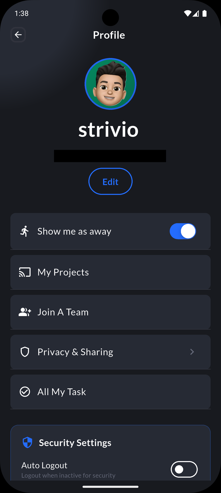 |

| **Dashboard** | **Quick Menu** | **Shopping Lists** |
|:---:|:---:|:---:|
| 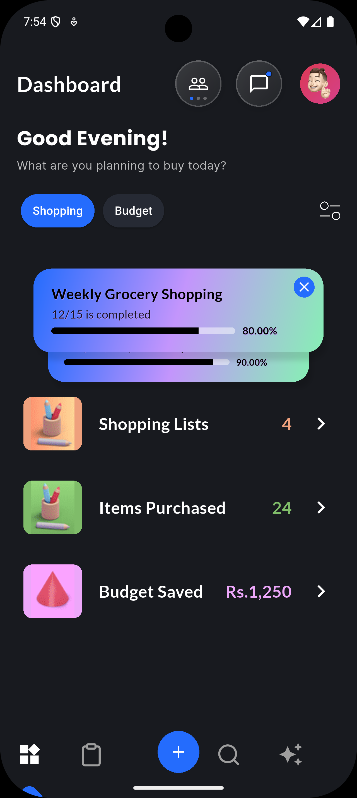 | 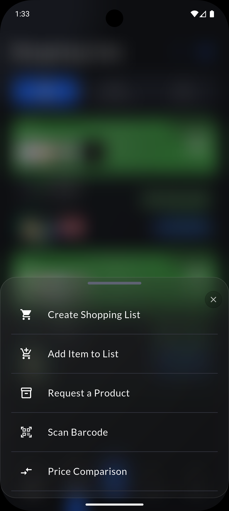 | 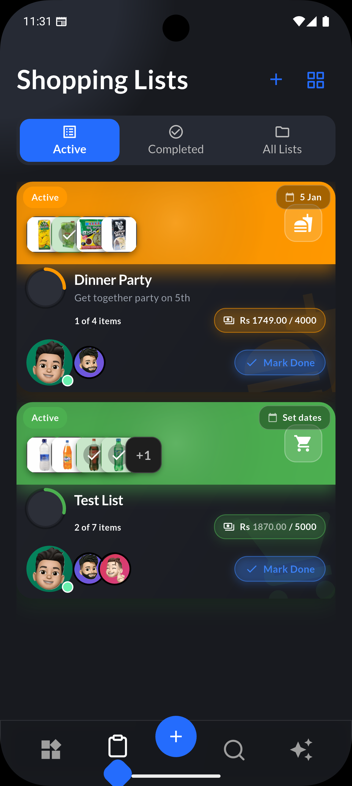 |

| **Search** | **Search Results I** | **Search Results II** |
|:---:|:---:|:---:|
| 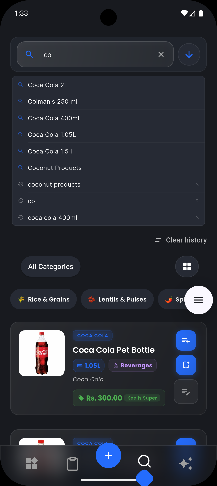 | 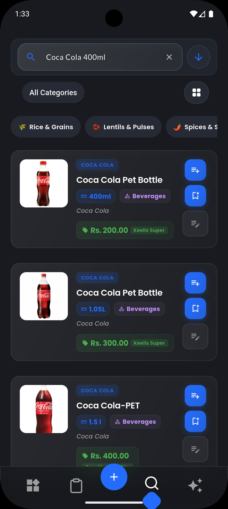 |  |

| **Product Details** | **Collaborative List** | **Chat** |
|:---:|:---:|:---:|
|  | 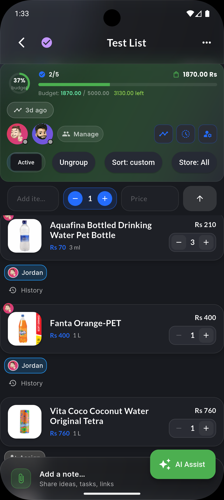 | 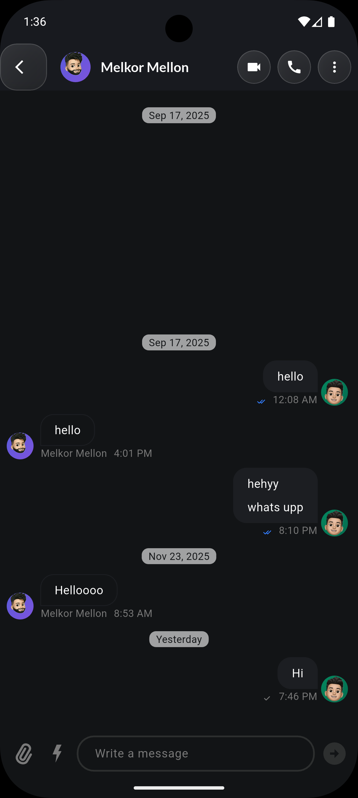 |

| **Request Menu** | **New Request** | **Budget** |
|:---:|:---:|:---:|
| 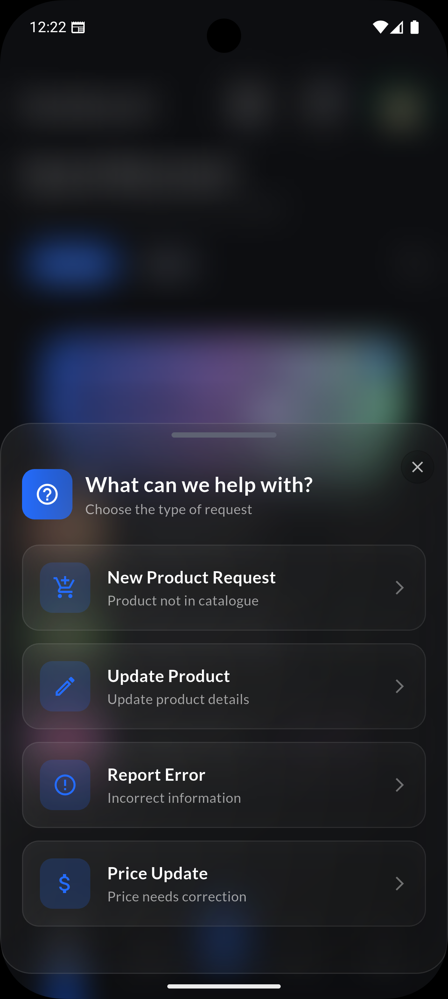 | 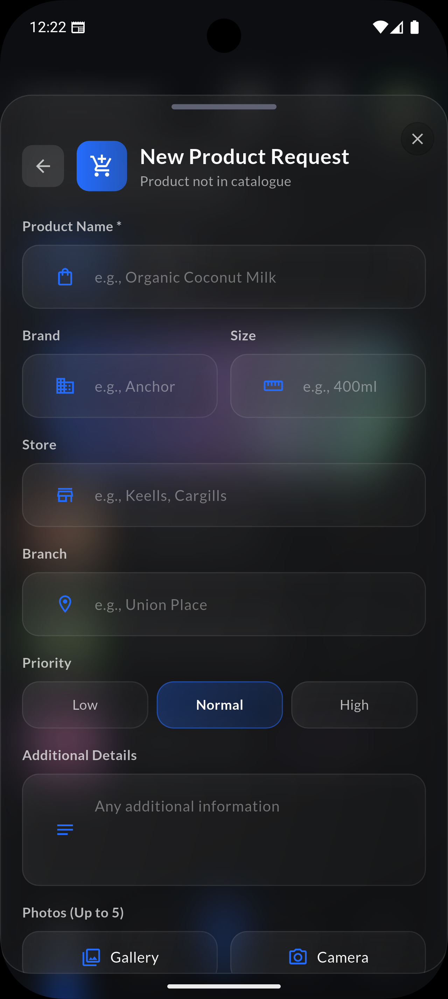 | 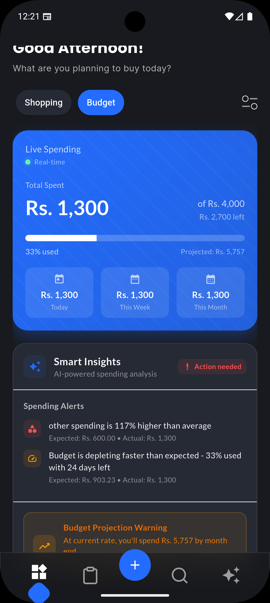 |

| **AI Assistant** | **History** | **Action I** |
|:---:|:---:|:---:|
| 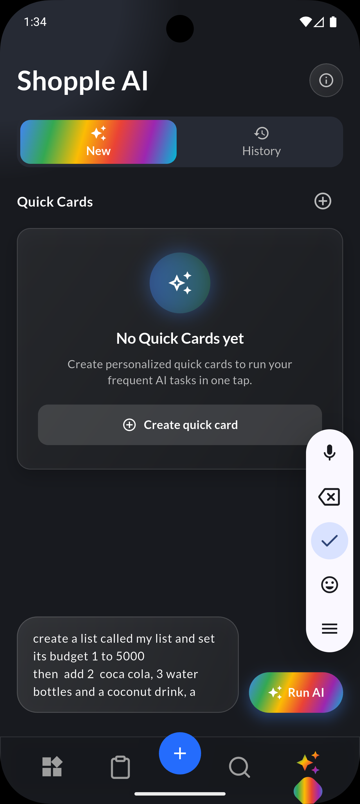 | 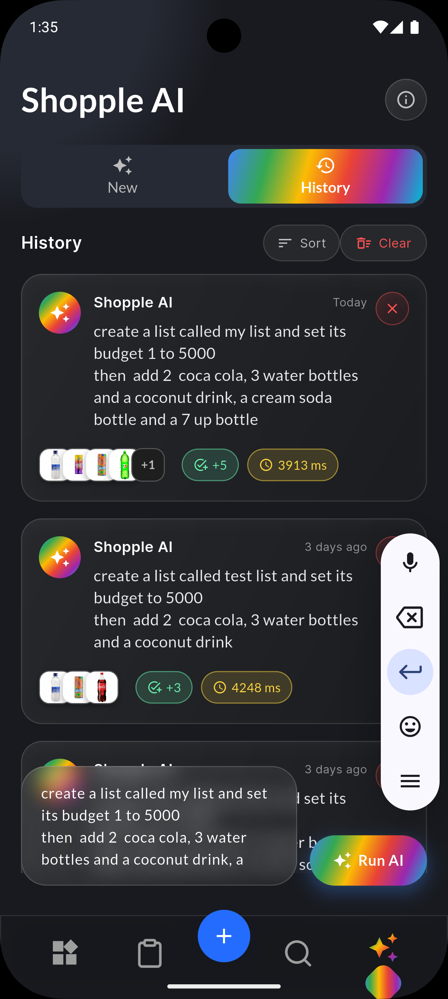 |  |

| **Action II** | **Action III** | **Action IV** |
|:---:|:---:|:---:|
| 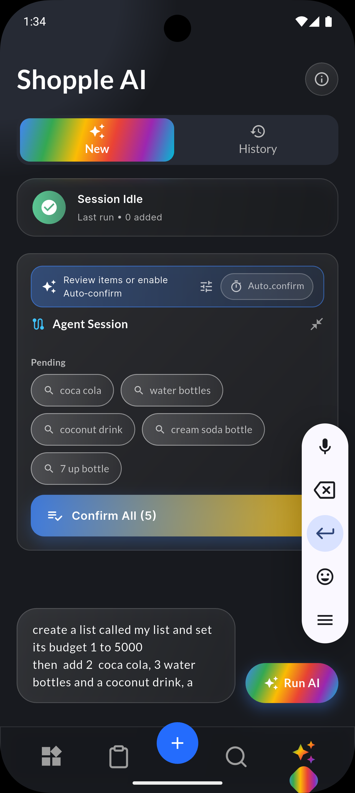 | 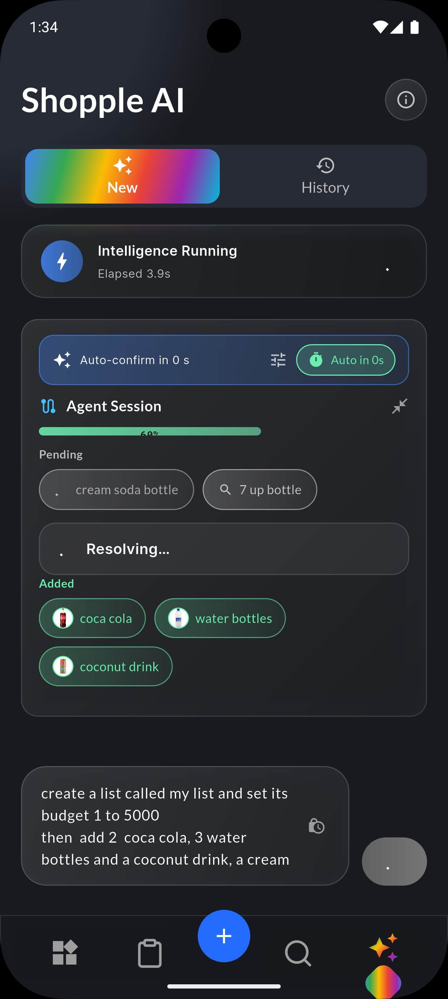 | 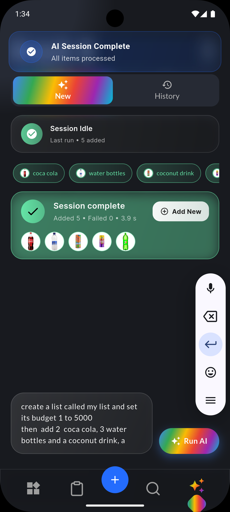 |

</div>


## Architecture Highlights

### Price Comparison Flow

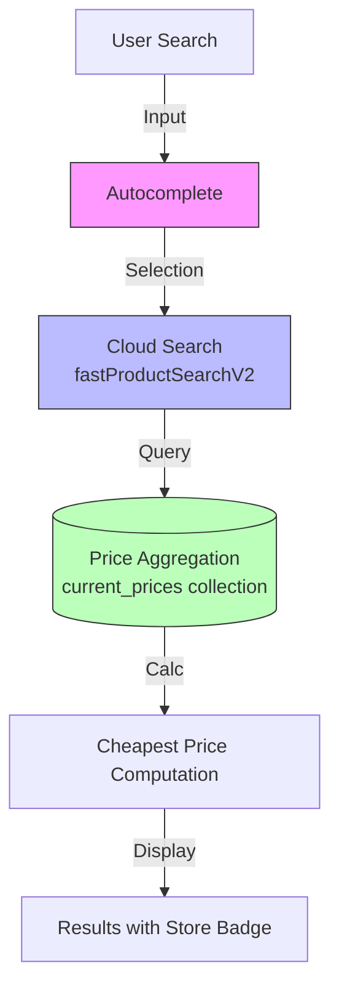

### Collaboration Flow

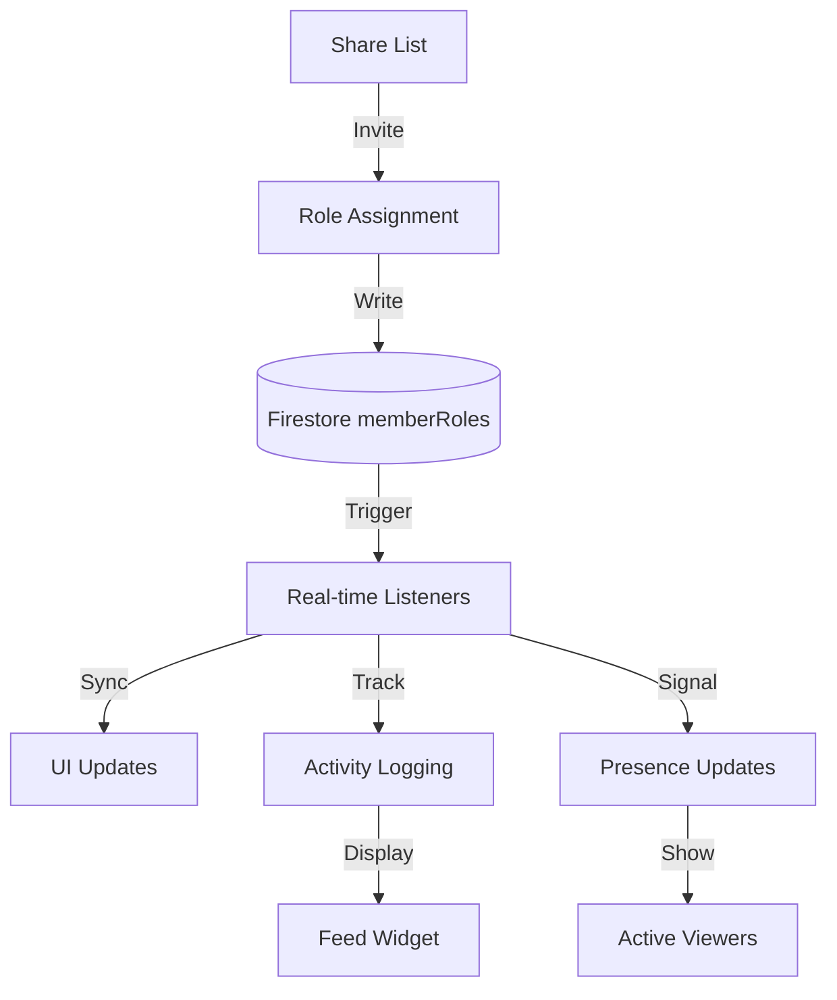

### Product Request Flow

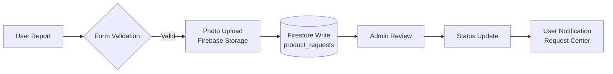


