# Shopple Advanced CI/CD Pipeline

This document outlines the automated Continuous Integration and Continuous Deployment (CI/CD) pipeline for the Shopple application, implemented using GitHub Actions.

## Overview

The pipeline is designed to ensure code quality, stability, and efficient deployment. It follows a multi-stage process that mimics industry-standard workflows, ensuring that only verified code is built and deployed.

## Pipeline Structure

The workflow is defined in `.github/workflows/flutter_ci.yml` and consists of the following sequential and parallel stages:

```mermaid
graph LR
    Start((Start)) --> Checkout[📥 SCM Checkout]
    Checkout --> Build[🛠️ Build & Analyze]
    Build --> TestUnit[🧪 Unit Tests]
    Build --> TestWidget[📱 Widget Tests]
    TestUnit --> Deploy[🚀 Deploy Android]
    TestWidget --> Deploy
    Deploy --> End((End))
    
    subgraph Reporting
    Notify[📢 Notify Slack]
    end
    
    Checkout -.-> Notify
    Build -.-> Notify
    TestUnit -.-> Notify
    TestWidget -.-> Notify
    Deploy -.-> Notify
```

### 1. 📥 SCM Checkout
*   **Goal**: Prepare the environment.
*   **Actions**:
    *   Check out the source code from the repository.
    *   Set up Java (Zulu 17).
    *   Set up Flutter (Stable channel).
    *   Install Dart/Flutter dependencies (`flutter pub get`).

### 2. 🛠️ Build & Analyze
*   **Goal**: Ensure code validity and static correctness.
*   **Actions**:
    *   Generate code and mocks using `build_runner`.
    *   Run static analysis using `flutter analyze` to catch linting errors and deprecations.
*   **Gate**: If this stage fails, the pipeline stops.

### 3. 🧪 Testing (Parallel Execution)
To reduce execution time, testing is split into two parallel jobs:

*   **Unit Tests**:
    *   Runs logic-heavy tests (Services, Models, Parsers).
    *   Target: `test/services`, `test/shopping_lists`, etc.
*   **Widget Tests**:
    *   Runs UI-heavy tests.
    *   Target: `test/ui`.

### 4. 🚀 Deploy Android
*   **Goal**: Create a release artifact.
*   **Condition**: Runs **only** if both Unit and Widget tests pass.
*   **Actions**:
    *   Builds the Android APK in release mode (`flutter build apk --release`).
    *   Uploads the APK as a GitHub Artifact (`app-release`).

### 5. 📢 Reporting
*   **Goal**: Visibility.
*   **Actions**:
    *   Runs at the end of the workflow, regardless of success or failure.
    *   Sends a detailed message to Slack with the status of each stage.
    *   **Green**: Pipeline Succeeded.
    *   **Red**: Tests or Build Failed.
    *   **Orange**: Pipeline Cancelled/Skipped.

## Triggering the Pipeline

The pipeline is automatically triggered on:
*   **Push** to `main` or `dev/wwi` branches.
*   **Pull Request** targeting the `main` branch.

## Artifacts

Upon successful completion, the following artifacts are available for download from the GitHub Actions run page:
*   `app-release`: The compiled Android APK.
