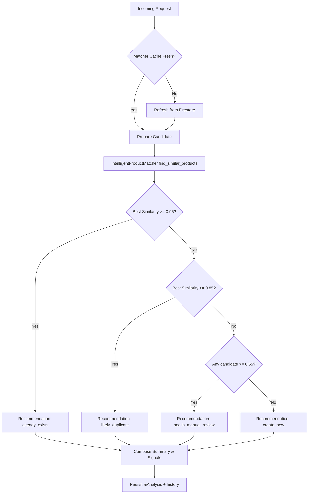

# Product Request System Design

## Overview

This document defines the end-to-end design for the **Product Request System**, a cross-platform workflow that enables shoppers to report missing products, empowers administrators to validate and action the requests, and leverages AI to pre-verify whether the requested items already exist in the catalogue.

The scope covers:

- Data contracts and storage for product requests, assets, activities, and AI insights.
- Backend endpoints, services, and AI integration for request lifecycle automation.
- Administrative UI modules for triage, acknowledgements, and reporting.
- Mobile integration guidelines (to be implemented later) aligned with backend/API behaviour.
- Non-functional requirements including security, observability, and extensibility.

## Goals & Requirements

1. **Capture rich user submissions** containing product metadata, store context, multiple media assets, and contact details.
2. **Automate verification** using AI-powered similarity checks against the existing product catalogue, highlighting likely duplicates or confirming gaps.
3. **Provide an admin console** to review, prioritise, acknowledge, annotate, and resolve product requests.
4. **Offer auditability** via activity trails, attachments, AI verdicts, and decision logs that persist in Firebase.
5. **Enable future mobile integration** without additional backend changes by exposing secure REST endpoints and storage locations.

## Data Model

> Stored in Firestore under the collection `product_requests`. Each document uses a deterministic `request_<timestamp>_<random>` ID.

| Field | Type | Description |
| --- | --- | --- |
| `productName` | string | Shopper-provided product name or description. |
| `brand` | string | Optional brand hint. |
| `size` | string | Optional size/unit string. Parsed server-side for AI analysis. |
| `categoryHint` | string | Shopper-provided category suggestion. |
| `store` | string | Supermarket or retail outlet name. |
| `storeLocation` | object `{branch, aisle, shelf}` | Granular location metadata. |
| `description` | string | Free-text context (why missing, alternatives, etc.). |
| `priority` | enum `low | normal | high` | Shopper-selected urgency; admins can override. |
| `status` | enum `submitted | in_review | acknowledged | resolved | rejected` | Current lifecycle stage. |
| `submittedBy` | object `{userId, displayName, email, phone}` | Shopper identity (optional today, ready for future auth). |
| `submissionSource` | enum `mobile | web | admin` | Source channel. |
| `attachments` | array of `{url, storagePath, contentType, width, height, uploadedAt}` | Firebase Storage assets. |
| `aiAnalysis` | object | AI verdict payload (see below). |
| `adminNotes` | array of `{id, authorId, authorName, note, visibility, createdAt}` | In-app annotations. |
| `assignedTo` | object `{adminId, adminName}` | Current owner. |
| `labels` | array<string> | Custom admin tagging. |
| `history` | array of `{timestamp, actorId, actorName, action, metadata}` | Lightweight audit log for quick reads. |
| `createdAt/updatedAt` | timestamps | Firestore server timestamps. |

### AI Analysis Payload (`aiAnalysis`)

```json
{
  "status": "pending | running | complete | failed",
  "lastRun": "<timestamp>",
  "matcherVersion": "<semantic version>",
  "summary": "Short human-readable verdict",
  "recommendation": "already_exists | likely_duplicate | create_new | needs_manual_review",
  "confidence": 0.0,
  "matchedProductId": "products/<docId>" | null,
  "matches": [
    {
      "productId": "products/<docId>",
      "name": "",
      "brand": "",
      "size": "",
      "category": "",
      "similarity": 0.0,
      "reasons": ["PERFECT EXACT MATCH", "High token overlap"],
      "imageUrl": ""
    }
  ],
  "signals": {
    "catalogueHit": true,
    "catalogueProductId": "",
    "exactMatchScore": 1.0,
    "tokenOverlap": 0.78,
    "sizeComparison": "match | mismatch | unknown"
  }
}
```

### Activity Stream

Large comment history is stored under a sub-collection `product_requests/<requestId>/activity` allowing pagination and long-tail event logging (e.g., reassignments, AI reruns, attachments added).

## Storage

- Product request images are stored in Firebase Cloud Storage under: `product-requests/{requestId}/{timestamp}.{ext}`.
- A signed URL (60-minute lifetime by default) is generated on request fetch for admin preview; the raw `storagePath` is persisted for re-generation.
- Maximum 5 images per request; original resolution is capped server-side to 1280px longest edge to control storage cost.

## Backend Architecture

### Modules

| Module | Responsibility |
| --- | --- |
| `services/firebase_service.py` | Extended with `get_client()` and signed URL utilities for storage. |
| `services/product_request_service.py` | Firestore CRUD helpers, AI dispatch, storage upload, and audit logging. |
| `services/product_request_ai.py` | Wrapper around `IntelligentProductMatcher` that orchestrates similarity scoring + rule-based recommendations. |
| `routes/product_request_routes.py` | REST endpoints for admin + mobile clients. |
| `routes/__init__.py` | Exports blueprint. |
| `scripts/intelligent_product_matcher.py` | Reused AI logic; new accessor functions added (e.g., `evaluate_request`). |

### Request Lifecycle

1. **Submission** (`POST /api/product-requests`) validates payload, uploads images, stores Firestore doc (`status=submitted`, `aiAnalysis.status=pending`).
2. Immediately triggers `ProductRequestAI.analyze(requestDoc)` synchronously (guarded with timeout + circuit breaker). Result persisted atomically along with history entry.
3. Admin UI consumes `GET /api/product-requests` (filterable, paginated). Each item includes AI summary, attachments (signed URLs), and latest history snippet.
4. Admin actions (`acknowledge`, `resolve`, `reject`, `assign`, `addNote`, `rerunAI`) call dedicated endpoints that update Firestore, append history, and (where relevant) refresh the AI analysis.
5. Optional future automation: automatically create tasks for catalogue managers when `recommendation=create_new`.

### AI Analysis Flow



- Cache refresh runs at most every 15 minutes; manual overrides can force refresh via `POST /api/product-requests/cache/refresh`.
- Analysis returns within ~500ms assuming cache warm.

## API Endpoints

| Method & Path | Purpose | Auth |
| --- | --- | --- |
| `POST /api/product-requests` | Shopper submission (supports multipart or JSON + base64). | Public (rate-limited, API key optional). |
| `GET /api/product-requests` | Admin listing with filters (`status`, `priority`, `store`, `recommendation`, `search`, `page`, `pageSize`). | Admin. |
| `GET /api/product-requests/<id>` | Detailed view including signed URLs and history (paged). | Admin. |
| `PUT /api/product-requests/<id>` | Update mutable fields (`priority`, `labels`, `assignedTo`, `status` transitions). | Admin. |
| `POST /api/product-requests/<id>/acknowledge` | Quick action to acknowledge + optionally assign. | Admin. |
| `POST /api/product-requests/<id>/notes` | Add admin note. | Admin. |
| `POST /api/product-requests/<id>/ai` | Re-run AI analysis (forces cache refresh optionally). | Admin. |
| `GET /api/product-requests/stats` | Aggregated counts/time-series for dashboard widgets. | Admin. |
| `POST /api/product-requests/cache/refresh` | Force refresh matcher cache (guarded). | Super-admin only. |

> All admin endpoints reuse existing session authentication middleware. Shopper submission is protected by reCAPTCHA token validation (stubbed in initial implementation, flagged as TODO).

## Frontend Architecture

### Routing & Navigation

- New route: `/app/product-requests`
- Sidebar entry added under core tools with badge counts for pending items (fetched from `/stats`).

### Page Composition

1. **Header** – summary metrics (pending, flagged by AI, acknowledged, SLA breaches) + quick filters.
2. **Filter Bar** – status chips, AI recommendation toggle, store dropdown, date range picker, free-text search.
3. **Requests Table** – virtualised list with columns: requester, product, store, AI recommendation, priority, status, submitted time. Supports multi-select for bulk actions (`Assign`, `Mark resolved`, `AI re-run`).
4. **Details Drawer** – On row select, slide-over shows:
   - Requester + store context
   - Image carousel (signed URLs)
   - AI verdict (confidence gauge, recommended action, top matches with links to `/app/products/manage?productId=...`)
   - Admin actions (Acknowledged / Resolve / Reject / Add note / Re-run AI / Assign)
   - History timeline with filtering.

### State Management

- Dedicated Zustand slice `useProductRequestStore` for filters, pagination, selection, and cached responses.
- Data fetching via typed `productRequestsApi` module using `fetch` with abort controllers + CSRF headers (same as existing `adminApi`).
- Optimistic updates for note creation and status transitions; fallback to server state on failure.
- File previews use signed URLs refreshed on demand (re-fetched when older than 50 minutes).

### Reusable Components

- `ProductRequestFilters.tsx`
- `ProductRequestTable.tsx`
- `ProductRequestDetailDrawer.tsx`
- `AIRecommendationBadge.tsx`
- `AttachmentGallery.tsx`
- `StatusTimeline.tsx`

## Mobile Integration Guidelines

- Mobile client submits via `POST /api/product-requests` using multipart form-data for images to avoid base64 overhead.
- Required fields: `productName`, `store`, at least one contact detail (`email` or `phone`), and at least one attachment or description.
- On success, response includes `requestId` and `aiAnalysis.summary` for immediate feedback.
- Rate-limiting and CAPTCHA verification to be added before launch (tracked separately).

## Security & Compliance

- Firebase credentials remain server-side; mobile uploads signed using REST endpoint (no direct Firebase Storage access).
- Image uploads scanned for type/size; disallow >5MB or unsupported MIME.
- Activity log records admin actions (actor ID derived from session user ID).
- RBAC: reuse existing admin vs super-admin custom claims.
- PII stored only when provided; optional purge job to anonymise aged requests.

## Observability

- Structured logging via `logging` module with contextual metadata (requestId, adminId).
- Metrics stub for future Prometheus integration (counts of AI outcomes, SLA breaches).
- Firestore indexes to create: composite on `status + priority + createdAt`, `aiAnalysis.recommendation + createdAt`.

## Implementation Plan

1. Extend Firebase service with client accessor, storage helpers, and signed URL support.
2. Introduce product request service + AI orchestrator (unit-testable logic).
3. Add Flask blueprint with endpoints outlined above.
4. Wire blueprint in `app.py` and update backend requirements (e.g., `Pillow` for image resizing if used).
5. Implement frontend data layer (`lib/productRequestsApi.ts`).
6. Build Product Request page components and integrate into router + sidebar.
7. Add automated tests: backend unit tests for AI recommendations (using cached fixture) and integration tests for endpoint validators.
8. Update docs (`README`, deployment guide) with new environment variables and usage instructions.
9. Smoke test end-to-end: create sample request with mock image, validate admin UI workflow.

## Future Enhancements

- SLA engine for prioritising ageing requests with escalation notifications.
- Auto-create product drafts in the admin portal when AI recommends `create_new`.
- Sentiment analysis on description field to detect urgent tone.
- Real-time WebSocket channel for live updates in the admin console.
- Duplicate detection across requests (merge suggestions).
