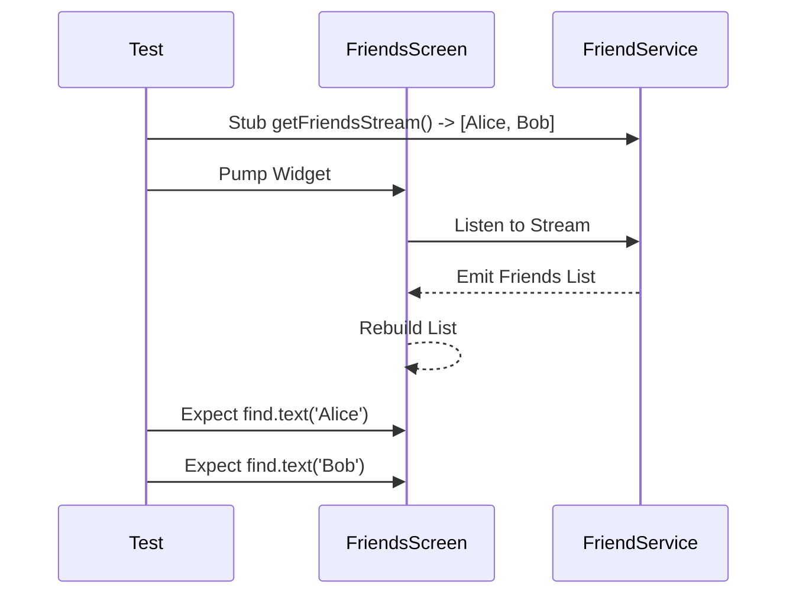
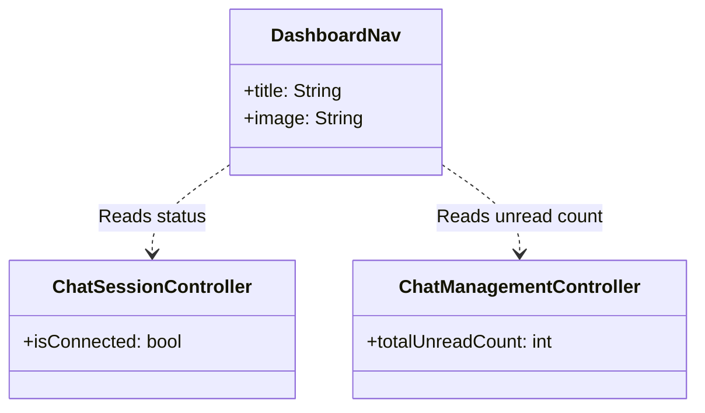
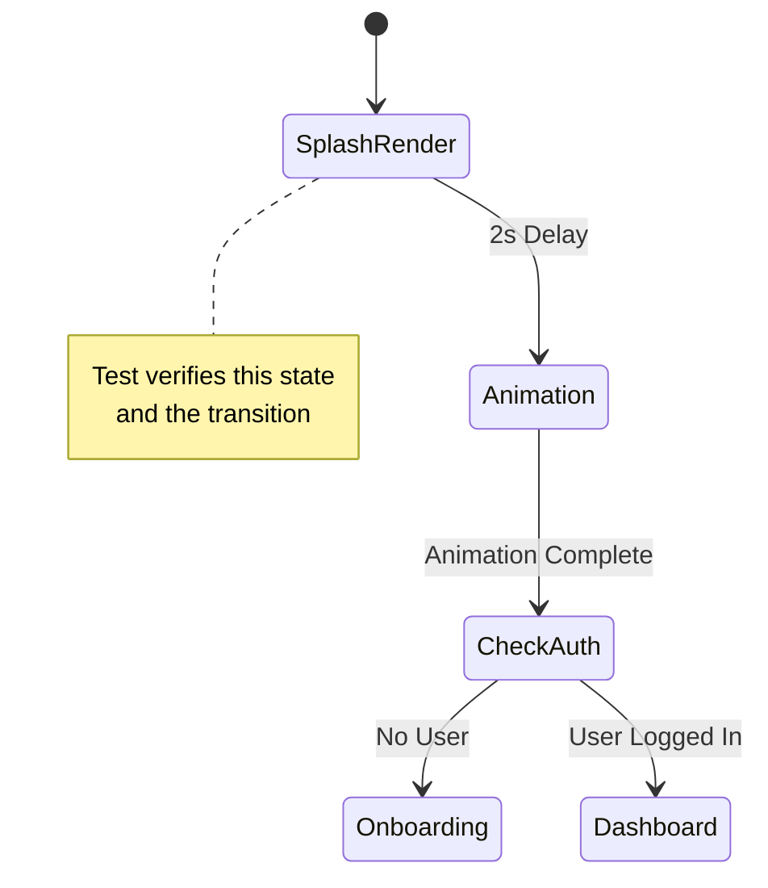

# Additional UI Tests

## Overview
This document details the UI tests for the Friends Screen, Dashboard Navigation, and Splash Screen. These tests verify rendering, navigation, and integration with mocked services.

## Test Files & Coverage

### 1. Friends Screen
- **File**: `test/ui/friends_screen_test.dart`
- **Target Widget**: `FriendsScreen` (`lib/Screens/friends/friends_screen.dart`)
- **Objective**: Verify the display of the friends list and integration with `FriendService`.

#### Test Scenarios
1.  **Render Friends List**:
    *   **Setup**:
        *   Mock `FriendService` to return a stream of 2 `Friend` objects (Alice, Bob).
        *   Mock pending requests count to 0.
    *   **Action**: Pump the `FriendsScreen` widget.
    *   **Checks**:
        *   Widgets for "Alice" and "Bob" are found.
        *   Profile images (or placeholders) are rendered.

### 2. Dashboard Navigation
- **File**: `test/ui/dashboard_nav_test.dart`
- **Target Widget**: `DashboardNav` (`lib/widgets/Navigation/dasboard_header.dart`)
- **Objective**: Verify the dashboard header renders correctly with user information and status indicators.

#### Test Scenarios
1.  **Render Header**:
    *   **Setup**:
        *   Mock `ChatSessionController` (`isConnected` = true).
        *   Mock `ChatManagementController` (`totalUnreadCount` = 5).
        *   Set `ChatDependencyInjector.isChatReady` = true.
    *   **Action**: Pump `DashboardNav` with title "Hello, User".
    *   **Checks**:
        *   Title "Hello, User" is displayed.
        *   User avatar image is loaded (mocked).
        *   (Implicit) Chat status indicators would be checked if specific widgets were targeted.

### 3. Splash Screen
- **File**: `test/ui/splash_screen_test.dart`
- **Target Widget**: `SplashScreen` (`lib/Screens/splash_screen.dart`)
- **Objective**: Verify the initial launch screen renders and attempts navigation.

#### Test Scenarios
1.  **Render and Navigate**:
    *   **Setup**:
        *   Mock `UserController`.
        *   Mock `FirebaseAuth` (via `FirebaseTestHelper`).
        *   Configure screen size to prevent overflow during animation.
    *   **Action**: Pump `SplashScreen`.
    *   **Checks**:
        *   `ShoppleSplashScreen` widget is present.
        *   Wait for animation duration (3 seconds).
        *   Verify no crashes during the navigation attempt (logic handles auth state check).

