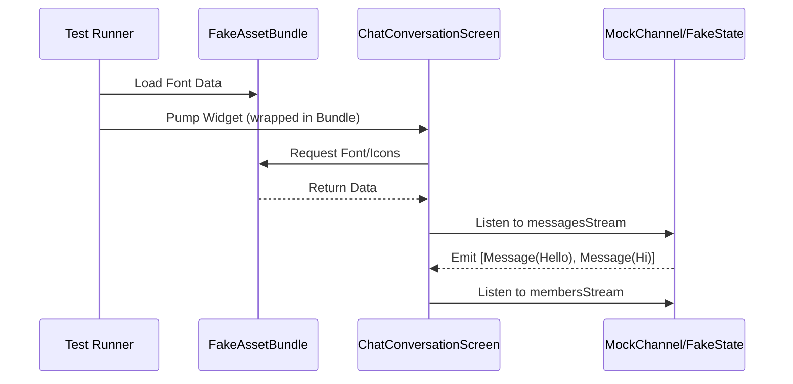
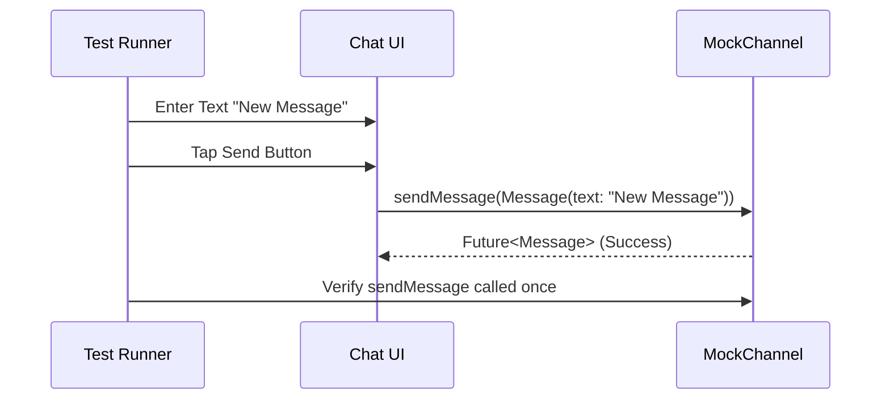

# Chat Conversation Screen Tests

This document details the testing strategy and implementation for the `ChatConversationScreen` in the Shopple app. These tests ensure the chat interface renders correctly, handles user interactions, and integrates properly with the Stream Chat SDK.

## Test File Location
`test/ui/chat_conversation_screen_test.dart`

## Test Setup & Architecture

The tests use a combination of **Mockito** for mocking the Stream Chat Client and Channel, a manual **Fake** implementation (`FakeChannelClientState`) to handle the complex reactive state of a Stream Channel, and **FakeAssetBundle** for font loading.

### Key Components

1.  **MockStreamChatClient**: Mocks the top-level Stream Chat client.
2.  **MockChannel**: Mocks the specific `Channel` object being viewed.
3.  **FakeChannelClientState**: A crucial component that implements `ChannelClientState` and `ChannelState`. It provides the `Stream`s (e.g., `messagesStream`, `membersStream`) that the UI widgets listen to. Without this, `StreamMessageListView` would crash or show nothing.
4.  **MockChatManagementController**: Mocks the GetX controller responsible for app-specific chat logic.
5.  **FakeAssetBundle**: Intercepts asset requests to serve local font files and dummy SVGs for missing assets.

### Mocking Strategy

*   **Font & Asset Loading**: We use `FakeAssetBundle` to serve `OpenSans` for `Lato` requests and dummy SVGs for missing Stream Chat icons.
*   **Streams**: All streams (messages, members, typing events, etc.) are mocked to return `Stream.value(...)` with initial data.
*   **Capabilities**: `ownCapabilities` are mocked to ensure the current user has permission to send messages.
*   **Async Handling**: Tests use `tester.runAsync` to handle timers (like the audio recorder timer) that might otherwise cause tests to hang or fail.

## Test Cases

### 1. ChatConversationScreen Renders Correctly

**Objective**: Verify that the screen displays the correct header information, existing messages, and the message input area.

**Details**:
*   **Setup**:
    *   Initializes `FakeAssetBundle` with font data.
    *   Initializes the mock channel with a history of messages (one from "Other User", one from "Current User").
*   **Action**: Pumps the `ChatConversationScreen` widget wrapped in `DefaultAssetBundle`.
*   **Verification**:
    *   Checks for the presence of the "Other User" name in the AppBar.
    *   Checks that the message "Hello" (from the mock data) is visible.
    *   Ensures the `StreamMessageInput` widget is present.

**Mermaid Chart**:

### 2. ChatConversationScreen Sends Message

**Objective**: Verify that typing text and tapping the send button triggers the correct API call on the channel.

**Details**:
*   **Setup**: Mocks `channel.sendMessage` to return a successful response.
*   **Action**:
    1.  Finds the `TextField` and enters "New Message".
    2.  Finds the Send button (via `IconButton` or `TextInputAction`) and taps it.
*   **Verification**:
    *   Uses `verify(mockChannel.sendMessage(any)).called(1)` to ensure the underlying SDK method was invoked.

**Mermaid Chart**:

## Optimization Notes

During the development of these tests, several optimizations and fixes were identified:
1.  **Timer Management**: The `StreamMessageInput` uses an internal timer for audio recording. Tests must use `runAsync` to prevent pending timer exceptions.
2.  **Capability Handling**: The `Channel` mock must explicitly provide `ownCapabilities` to enable the message input.
3.  **Widget Finding**: Finding the specific "Send" button can be tricky due to icon fonts. The test uses a robust strategy of finding `IconButton`s or using `TextInputAction.send`.
