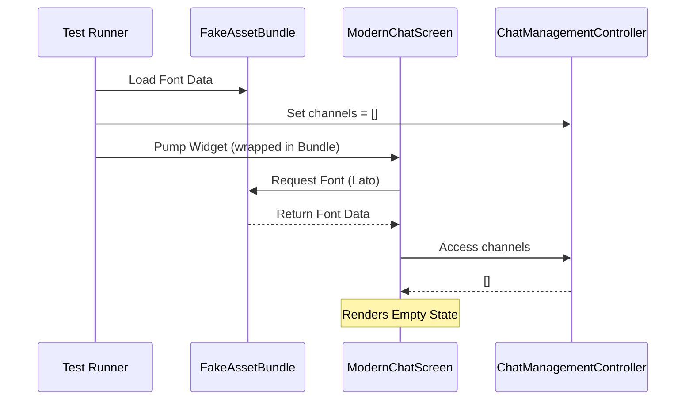
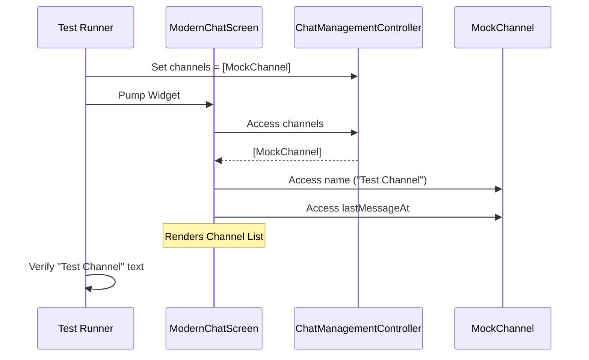

# Modern Chat Screen Tests

This document details the testing strategy and implementation for the `ModernChatScreen` in the Shopple app. These tests ensure the main chat list interface renders correctly, handles empty states, and displays channel information properly.

## Test File Location
`test/ui/modern_chat_screen_test.dart`

## Test Setup & Architecture

The tests use **Mockito** to mock the Stream Chat Client and GetX Controllers, and a custom **FakeAssetBundle** to handle font loading without network requests.

### Key Components

1.  **MockStreamChatClient**: Mocks the top-level Stream Chat client.
2.  **MockChatManagementController**: Mocks the GetX controller responsible for managing the list of channels.
3.  **MockChatSessionController**: Mocks the connection status and session state.
4.  **FakeAssetBundle**: Intercepts asset requests (specifically for Google Fonts) to serve local font files, bypassing network calls and checksum validation.

### Mocking Strategy

*   **Font Loading**: We disable runtime fetching (`GoogleFonts.config.allowRuntimeFetching = false`) and inject a `FakeAssetBundle` that serves `OpenSans` bytes when `Lato` is requested. This prevents "checksum mismatch" errors during tests.
*   **GetX Controllers**: We use `Get.put` to inject mock controllers into the dependency injection system before the widget is pumped.
*   **Channel List**: The `ChatManagementController.channels` list is manually populated with mock channels to simulate different states (empty vs. populated).
*   **Async Handling**: Tests use `tester.runAsync` to handle image loading and other async operations.

## Test Cases

### 1. ModernChatScreen Renders Empty State Correctly

**Objective**: Verify that the screen displays a friendly message when there are no conversations.

**Details**:
*   **Setup**: 
    *   Initializes `FakeAssetBundle` with font data.
    *   Sets `mockManagementController.channels` to an empty list.
*   **Action**: Pumps the `ModernChatScreen` widget wrapped in `DefaultAssetBundle`.
*   **Verification**:
    *   Checks for the text "No conversations yet".

**Mermaid Chart**:

### 2. ModernChatScreen Renders Channels

**Objective**: Verify that the screen displays a list of channels when they are available.

**Details**:
*   **Setup**: 
    *   Creates a `MockChannel` with name "Test Channel".
    *   Sets `mockManagementController.channels` to `[mockChannel]`.
*   **Action**: Pumps the `ModernChatScreen` widget.
*   **Verification**:
    *   Checks that the text "Test Channel" is visible.

**Mermaid Chart**:

## Optimization Notes

*   **Controller Injection**: Using `Get.put` in `setUp` ensures a clean state for each test.
*   **Network Images**: `mockNetworkImagesFor` is used to prevent network calls for user avatars.
