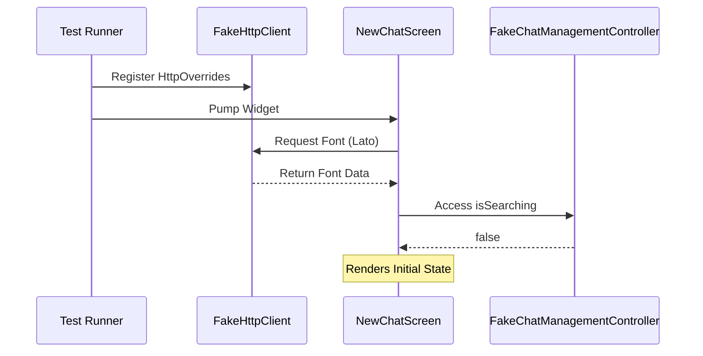
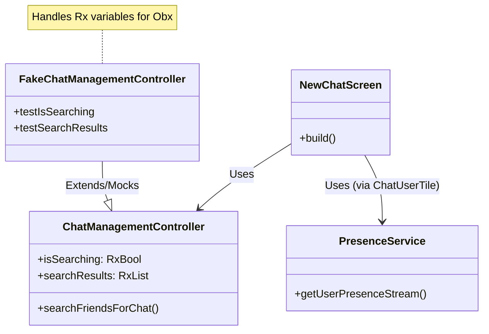

# New Chat Screen Tests

## Overview
This document details the testing strategy and implementation for the `NewChatScreen` widget. The tests cover UI rendering, empty states, friend list display, and navigation to chat conversations.

## Test File
- **Path**: `test/ui/new_chat_screen_test.dart`
- **Target Widget**: `NewChatScreen` (`lib/Screens/Chat/new_chat_screen.dart`)

## Test Scenarios

### 1. UI Rendering
- **Objective**: Verify that the screen renders the essential UI components.
- **Checks**:
  - Title "New Chat" is present.
  - "Friends" and "All Users" tabs/sections are visible.
  - Search bar (`TextField`) is displayed.

### 2. Empty State
- **Objective**: Verify the UI when no friends are found.
- **Setup**: Mock `searchFriendsForChat` to return an empty list.
- **Checks**:
  - "No friends yet" text is displayed.
  - "Add friends to start chatting" text is displayed.

### 3. Friends List Display
- **Objective**: Verify that friends are displayed correctly in the list.
- **Setup**: Mock `searchFriendsForChat` to return a list of `ChatUserModel` objects.
- **Checks**:
  - Friend names are displayed.
  - Chat icons are present.

### 4. Navigation to Chat
- **Objective**: Verify that tapping a friend navigates to the chat conversation.
- **Setup**: 
  - Mock `searchFriendsForChat` to return a friend.
  - Mock `StreamChatClient` and `Channel` to support `ChatConversationScreen`.
- **Checks**:
  - Tapping a friend tile triggers navigation (verified by checking if `ChatConversationScreen` is pushed or by checking side effects if possible, here we verify no crash and mock interactions).

## Mocks Used

### FakeChatManagementController
A custom fake controller extending `MockChatManagementController` is used to handle GetX reactive variables (`RxBool`, `RxList`) correctly.
- **Overrides**:
  - `isSearching`: Returns a real `RxBool`.
  - `searchResults`: Returns a real `RxList`.
  - `onStart`, `onDelete`: Stubbed to return dummy `InternalFinalCallback`.

### FakePresenceService
A fake service implementing `IPresenceService` to handle user presence streams without Firebase initialization.
- **Overrides**:
  - `getUserPresenceStream`: Returns a stream of `UserPresenceStatus.offline()`.

### MockChannel & MockStreamChatClient
Mockito generated mocks are used for Stream Chat SDK components.
- **Stubs**:
  - `markRead`: Returns `FakeEmptyResponse`.
  - `watch`: Returns `FakeChannelState`.
  - `queryMembers`: Returns `FakeQueryMembersResponse`.
  - `memberCount`: Returns 2.
  - `name`: Returns "Test Channel".
  - `image`: Returns a dummy URL.

## Test Setup & Architecture

The tests use **Mockito** to mock the Stream Chat Client and GetX Controllers. Unlike other chat tests, this test currently uses `HttpOverrides` with a `FakeHttpClient` to handle font loading.

### Key Components

1.  **FakeChatManagementController**: A custom fake controller extending `MockChatManagementController` to handle GetX reactive variables (`RxBool`, `RxList`) correctly.
2.  **FakeHttpClient**: Intercepts network requests for fonts and returns local font bytes.

**Mermaid Chart**:

## Mermaid Diagram

## Known Issues
- **Font Loading**: Tests may report exceptions regarding `GoogleFonts` loading assets after test completion. This is a known issue with `google_fonts` in tests and does not affect the validity of the logic tests.
