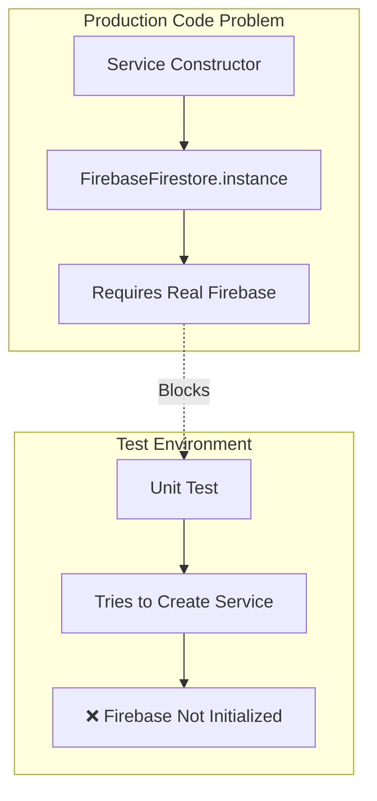
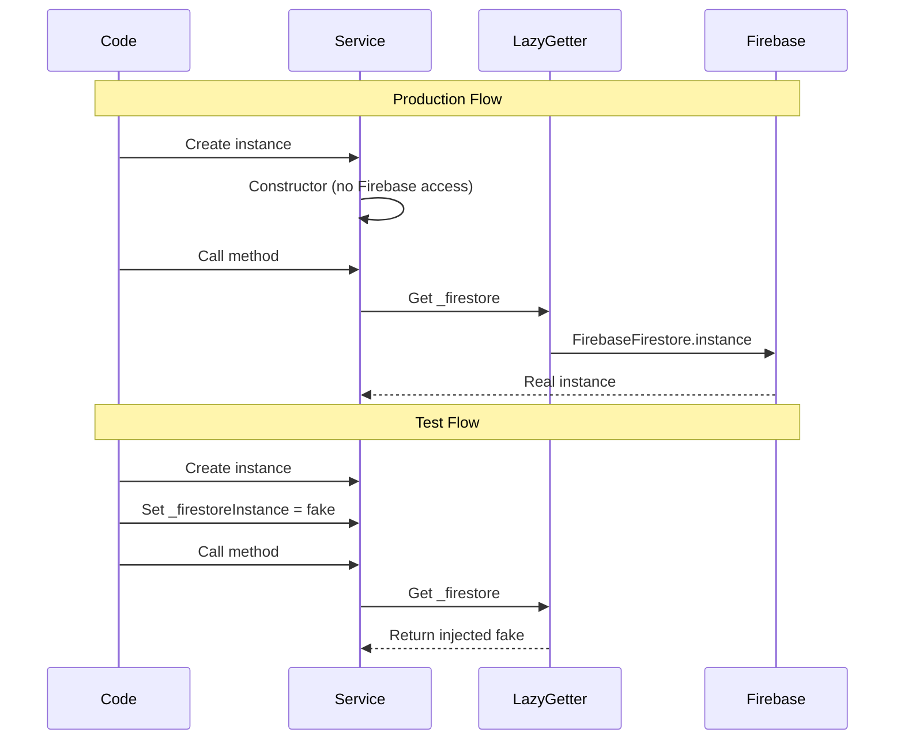
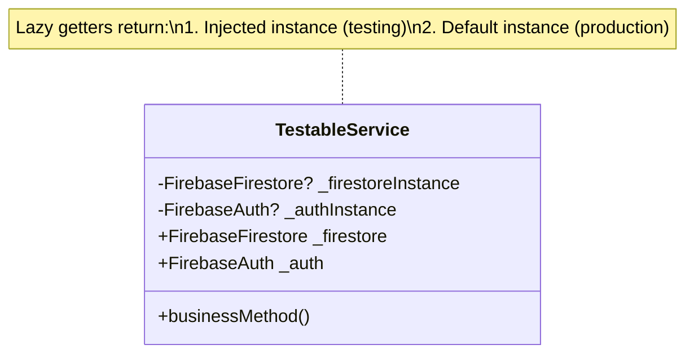
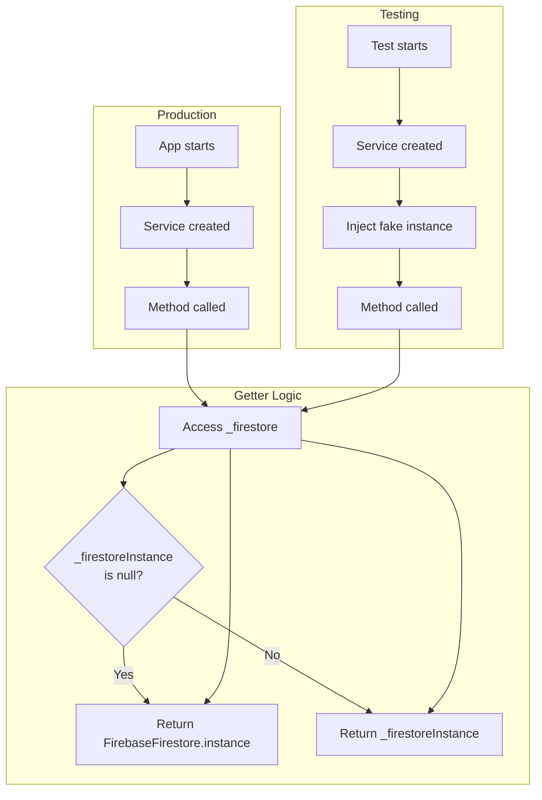
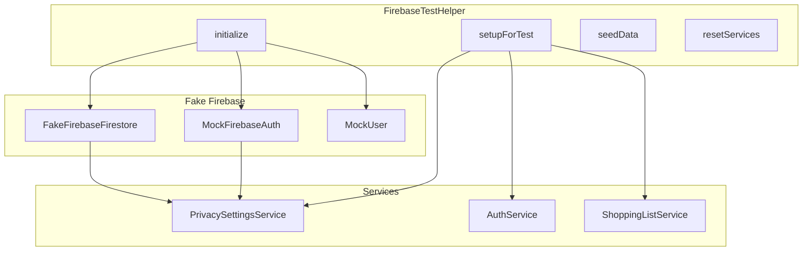
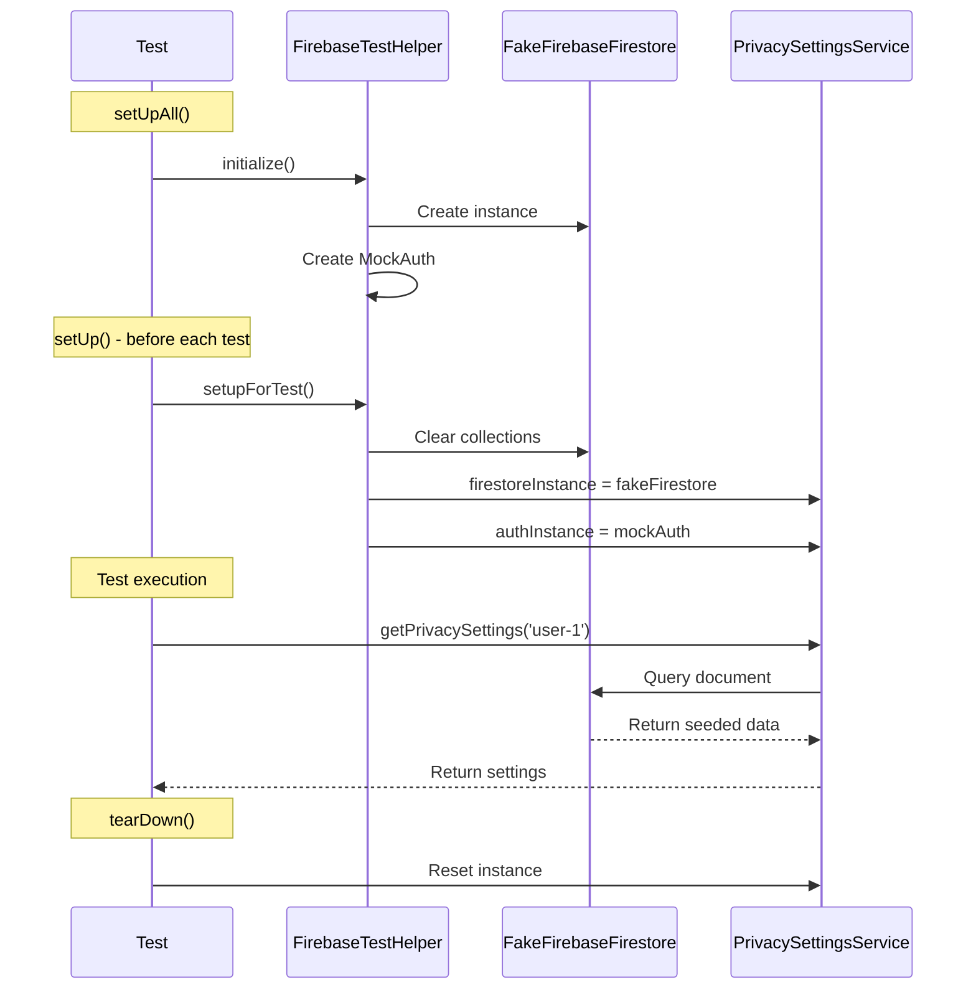
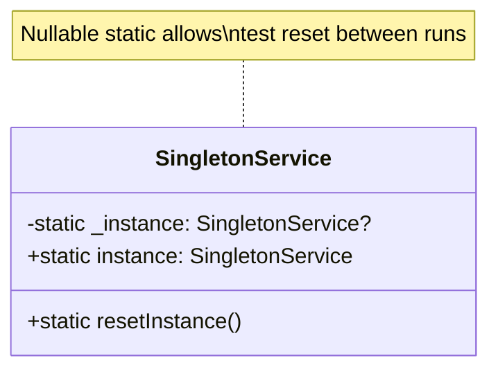
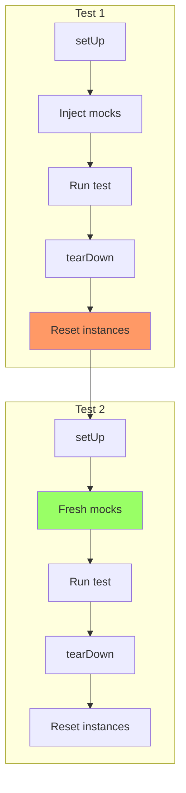
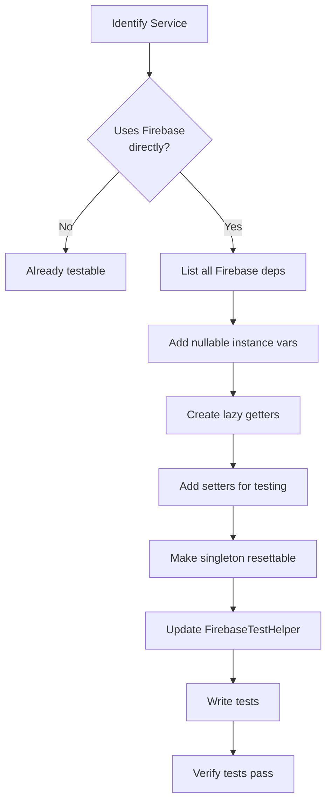

# Service Testability Implementation Guide

This document explains the testability patterns implemented for Firebase-dependent services in the Shopple app.

## Table of Contents

1. [Problem Statement](#problem-statement)
2. [Solution: Lazy Loading Pattern](#solution-lazy-loading-pattern)
3. [Implementation Examples](#implementation-examples)
4. [Test Helper Infrastructure](#test-helper-infrastructure)
5. [Best Practices](#best-practices)

---

## Problem Statement

### The Challenge

Firebase services in Flutter typically use singleton patterns like `FirebaseFirestore.instance`. When these are hard-coded in service constructors, tests fail because:

1. Firebase isn't initialized in test environments
2. No way to inject fake/mock instances
3. Tests hit real Firebase (slow, unreliable, side effects)



### Symptoms

```dart
// This pattern breaks tests
class MyService {
  final _firestore = FirebaseFirestore.instance; // ❌ Called at construction
  
  MyService() {
    // Firebase must be initialized before this line
  }
}
```

Test error:
```
No Firebase App '[DEFAULT]' has been created - call Firebase.initializeApp()
```

---

## Solution: Lazy Loading Pattern

### Core Concept

Defer Firebase instance access until first use, allowing test injection before any Firebase calls.



### Pattern Structure



---

## Implementation Examples

### PrivacySettingsService

#### Before (Untestable)

```dart
class PrivacySettingsService {
  static final PrivacySettingsService _instance = PrivacySettingsService._internal();
  static PrivacySettingsService get instance => _instance;
  
  final _firestore = FirebaseFirestore.instance; // ❌ Hard-coded
  final _auth = FirebaseAuth.instance; // ❌ Hard-coded
  
  PrivacySettingsService._internal();
  
  Future<UserPrivacySettings?> getPrivacySettings(String userId) async {
    final doc = await _firestore
        .collection('users')
        .doc(userId)
        .collection('settings')
        .doc('privacy')
        .get();
    // ...
  }
}
```

#### After (Testable)

```dart
class PrivacySettingsService {
  static PrivacySettingsService? _instance;
  static PrivacySettingsService get instance => _instance ??= PrivacySettingsService._internal();
  static set instance(PrivacySettingsService? value) => _instance = value;
  
  // Lazy loading for Firestore
  FirebaseFirestore? _firestoreInstance;
  FirebaseFirestore get _firestore => _firestoreInstance ?? FirebaseFirestore.instance;
  set firestoreInstance(FirebaseFirestore? value) => _firestoreInstance = value;
  
  // Lazy loading for Auth
  FirebaseAuth? _authInstance;
  FirebaseAuth get _auth => _authInstance ?? FirebaseAuth.instance;
  set authInstance(FirebaseAuth? value) => _authInstance = value;
  
  PrivacySettingsService._internal();
  
  Future<UserPrivacySettings?> getPrivacySettings(String userId) async {
    final doc = await _firestore // Uses lazy getter
        .collection('users')
        .doc(userId)
        .collection('settings')
        .doc('privacy')
        .get();
    // ...
  }
}
```

### Flow Diagram



---

## Test Helper Infrastructure

### FirebaseTestHelper

Central helper class for setting up Firebase mocks across all tests.



### Test Setup Sequence



### Code Example

```dart
class FirebaseTestHelper {
  static late FakeFirebaseFirestore fakeFirestore;
  static late MockFirebaseAuth mockAuth;
  static late MockUser mockUser;
  
  static Future<void> initialize() async {
    fakeFirestore = FakeFirebaseFirestore();
    mockUser = MockUser(
      uid: 'test-user-id',
      email: 'test@example.com',
      displayName: 'Test User',
    );
    mockAuth = MockFirebaseAuth(mockUser: mockUser, signedIn: true);
  }
  
  static void setupPrivacySettingsService() {
    final service = PrivacySettingsService.instance;
    service.firestoreInstance = fakeFirestore;
    service.authInstance = mockAuth;
  }
  
  static Future<void> seedPrivacySettings(List<String> userIds) async {
    for (final userId in userIds) {
      await fakeFirestore
          .collection('users')
          .doc(userId)
          .collection('settings')
          .doc('privacy')
          .set({
            'profileVisibility': 'friends',
            'showOnlineStatus': true,
            'allowFriendRequests': true,
            'showActivityStatus': true,
            'showLastSeen': true,
          });
    }
  }
  
  static void tearDown() {
    PrivacySettingsService.instance = null;
  }
}
```

---

## Best Practices

### 1. Singleton with Reset Capability



```dart
class MyService {
  static MyService? _instance;
  static MyService get instance => _instance ??= MyService._internal();
  static set instance(MyService? value) => _instance = value; // For testing
  
  MyService._internal();
}
```

### 2. All Firebase Dependencies Lazy

```dart
class CompleteService {
  // ✅ All Firebase dependencies use lazy pattern
  FirebaseFirestore? _firestoreInstance;
  FirebaseFirestore get _firestore => _firestoreInstance ?? FirebaseFirestore.instance;
  
  FirebaseAuth? _authInstance;
  FirebaseAuth get _auth => _authInstance ?? FirebaseAuth.instance;
  
  FirebaseDatabase? _databaseInstance;
  FirebaseDatabase get _database => _databaseInstance ?? FirebaseDatabase.instance;
  
  FirebaseStorage? _storageInstance;
  FirebaseStorage get _storage => _storageInstance ?? FirebaseStorage.instance;
}
```

### 3. Test Isolation



### 4. Consistent Teardown

```dart
tearDown(() {
  // Reset ALL services that were mocked
  PrivacySettingsService.instance = null;
  AuthService.instance = null;
  PresenceService.instance = null;
  
  // Clear any cached data
  fakeFirestore.clearPersistence();
});
```

---

## Migration Checklist

When making a service testable, follow this checklist:



### Step-by-Step

1. **Identify Firebase dependencies**
   ```dart
   // Find all uses of:
   FirebaseFirestore.instance
   FirebaseAuth.instance
   FirebaseDatabase.instance
   FirebaseStorage.instance
   ```

2. **Add nullable instance variables**
   ```dart
   FirebaseFirestore? _firestoreInstance;
   ```

3. **Create lazy getters**
   ```dart
   FirebaseFirestore get _firestore => 
       _firestoreInstance ?? FirebaseFirestore.instance;
   ```

4. **Add setters (for test injection)**
   ```dart
   set firestoreInstance(FirebaseFirestore? value) => 
       _firestoreInstance = value;
   ```

5. **Make singleton resettable**
   ```dart
   static MyService? _instance;
   static set instance(MyService? value) => _instance = value;
   ```

6. **Update test helper**
   ```dart
   static void setupMyService() {
     MyService.instance.firestoreInstance = fakeFirestore;
   }
   ```

---

## Conclusion

The lazy loading pattern enables:

- ✅ Production code unchanged in behavior
- ✅ Full test isolation
- ✅ No Firebase initialization in tests
- ✅ Fast, reliable unit tests
- ✅ Easy mock injection

This pattern should be applied to all services that depend on Firebase or other external services that are difficult to mock directly.
