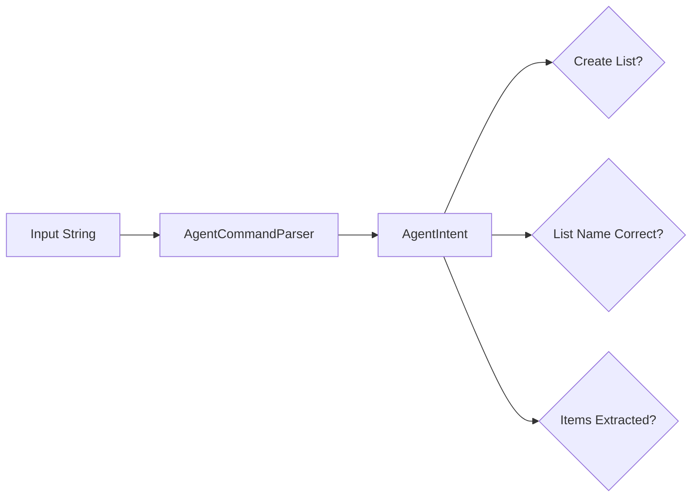
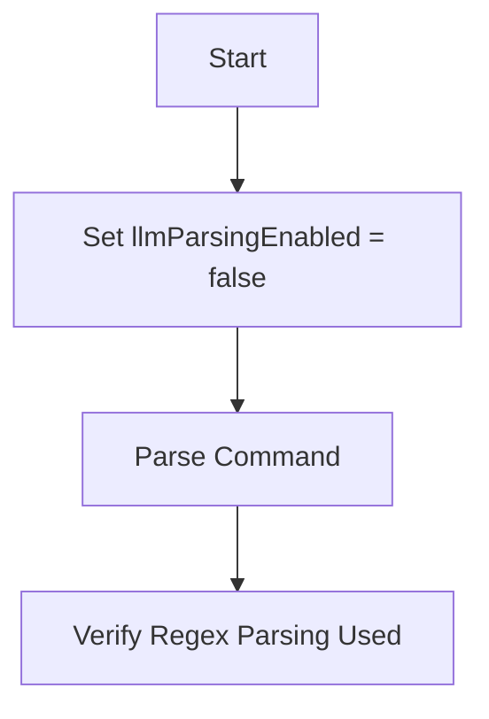
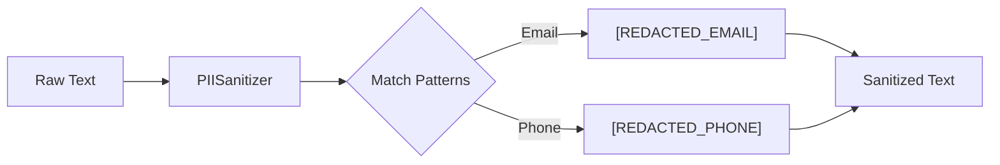
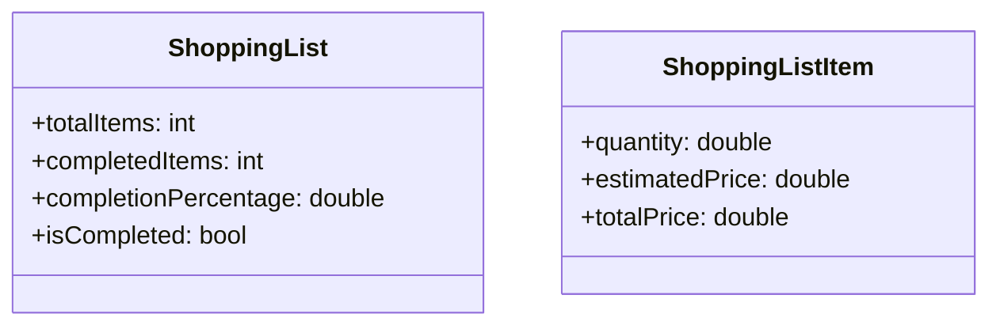
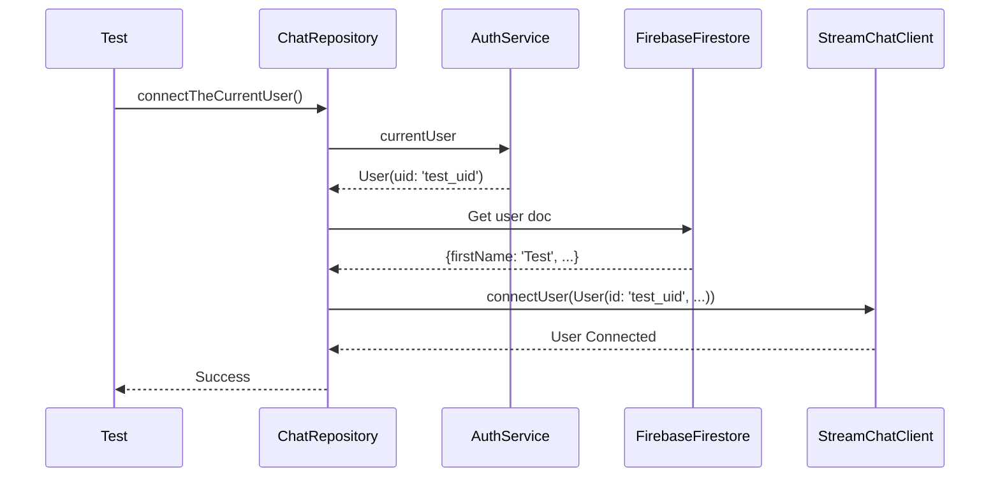

# Unit and Service Tests

## Overview
This document details the unit and service tests implemented to verify the core logic, data models, and backend service integrations of the Shopple app. These tests ensure that the business logic functions correctly independently of the UI.

## Test Files & Coverage

### 1. AI Agent Command Parser
- **File**: `test/agent_parser_test.dart`
- **Component**: `AgentCommandParser` (`lib/models/ai_agent/agent_intents.dart`)
- **Objective**: Verify that natural language commands are correctly parsed into structured intents (e.g., creating lists, adding items).

#### Test Scenarios
1.  **Parse Create List with Items**:
    *   **Input**: "Create a new list called dinner and add a meat type and coca cola"
    *   **Checks**:
        *   `createListRequested` is true.
        *   `listName` is "Dinner".
        *   `rawItemPhrases` contains "meat" and "coca".
2.  **Handle List Named Pattern**:
    *   **Input**: "Please create list named groceries and add milk, bread"
    *   **Checks**: `listName` is "Groceries".
3.  **Fallback List Name Sanitization**:
    *   **Input**: "create list called the test list and add apples"
    *   **Checks**: `listName` is sanitized to "Test" (removing redundant words like "the", "list").

### 2. LLM Parse Gating
- **File**: `test/llm_parse_gate_test.dart`
- **Component**: `AIFeatureFlags` & `AgentCommandParser`
- **Objective**: Verify that the application respects feature flags for AI capabilities.

#### Test Scenarios
1.  **Disable LLM Path**:
    *   **Setup**: Set `AIFeatureFlags.llmParsingEnabled = false`.
    *   **Action**: Parse a command string.
    *   **Checks**: The parser falls back to regex/keyword parsing instead of calling an LLM service (implied by immediate return and structure).

### 3. PII Sanitizer
- **File**: `test/pii_sanitizer_test.dart`
- **Component**: `PIISanitizer` (`lib/services/ai/pii_sanitizer.dart`)
- **Objective**: Verify that sensitive information (emails, phone numbers) is redacted from text before processing.

#### Test Scenarios
1.  **Redact Email**:
    *   **Input**: "Contact me at user@example.com please"
    *   **Checks**: Output contains `[REDACTED_EMAIL]` and not the original email.
2.  **Redact Phone**:
    *   **Input**: "My number is (555) 123-4567"
    *   **Checks**: Output contains `[REDACTED_PHONE]` and not the original number.

### 4. Shopping List Models
- **File**: `test/shopping_lists/models_test.dart`
- **Component**: `ShoppingList`, `ShoppingListItem`
- **Objective**: Verify data model logic, such as completion percentage and total price calculations.

#### Test Scenarios
1.  **Completion Percentage**:
    *   **Setup**: List with 5 items, 2 completed.
    *   **Checks**: `completionPercentage` is 40.0%.
2.  **Item Total Price**:
    *   **Setup**: Item with quantity 2 and price 150.
    *   **Checks**: `totalPrice` is 300.

### 5. Chat Repository
- **File**: `test/services/chat/chat_repository_test.dart`
- **Component**: `ChatRepository` (`lib/services/chat/chat_repository.dart`)
- **Objective**: Verify the integration between Firebase Auth, Firestore, and Stream Chat.

#### Test Scenarios
1.  **Connect Current User**:
    *   **Setup**: 
        *   Mock `AuthService` to return a user.
        *   Populate Fake Firestore with user data.
    *   **Action**: Call `connectTheCurrentUser`.
    *   **Checks**: 
        *   Stream Chat `connectUser` is called with correct ID.
        *   User data is synced to Stream Chat.

### 6. JWT Token Generation Utility
- **File**: `test/test_jwt.dart`
- **Type**: Utility Script
- **Objective**: A standalone script to verify the manual generation of JWT tokens for Stream Chat authentication using the `crypto` package. It prints the generated token and its decoded components for manual verification against Stream Chat requirements.
