# Unit Test Documentation

This document provides comprehensive documentation for the unit tests implemented in the Shopple app, including architecture diagrams using Mermaid.

## Table of Contents

1. [Overview](#overview)
2. [Test Architecture](#test-architecture)
3. [Model Tests](#model-tests)
4. [Service Tests](#service-tests)
5. [UI Tests](#ui-tests)
6. [Test Infrastructure](#test-infrastructure)

---

## Overview

The Shopple app uses a comprehensive testing strategy that covers:
- **Unit Tests**: Testing individual models, services, and utility functions
- **Widget Tests**: Testing UI components in isolation
- **Integration Tests**: Testing complete user flows

### Test Statistics

| Test Category | Test Count | Status |
|---------------|------------|--------|
| ShoppingListItem Model | 34 | ✅ Pass |
| Friend Model | 19 | ✅ Pass |
| Shopping List Model | 15+ | ✅ Pass |
| Budget Models | 10+ | ✅ Pass |
| QuickAddParser | 20+ | ✅ Pass |
| User Privacy Settings | 15+ | ✅ Pass |
| FriendsScreen UI | 3 | ✅ Pass |
| ModernChatScreen UI | 2 | ✅ Pass |

---

## Test Architecture

### High-Level Test Structure

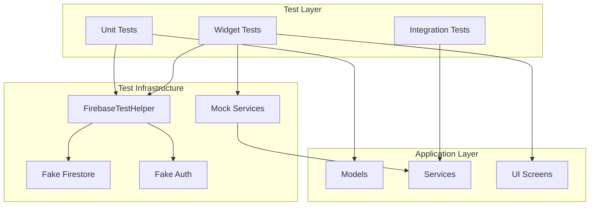
```mermaid
graph TB
    subgraph "Test Layer"
        UT[Unit Tests]
        WT[Widget Tests]
        IT[Integration Tests]
    end
    
    subgraph "Test Infrastructure"
        FTH[FirebaseTestHelper]
        MS[Mock Services]
        FF[Fake Firestore]
        FA[Fake Auth]
    end
    
    subgraph "Application Layer"
        Models[Models]
        Services[Services]
        UI[UI Screens]
    end
    
    UT --> Models
    WT --> UI
    IT --> Services
    
    FTH --> FF
    FTH --> FA
    MS --> Services
    
    UT --> FTH
    WT --> FTH
    WT --> MS
```

### Test Dependencies Flow

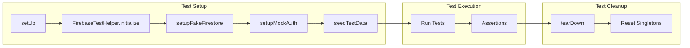
```mermaid
flowchart LR
    subgraph "Test Setup"
        A[setUp] --> B[FirebaseTestHelper.initialize]
        B --> C[setupFakeFirestore]
        C --> D[setupMockAuth]
        D --> E[seedTestData]
    end
    
    subgraph "Test Execution"
        E --> F[Run Tests]
        F --> G[Assertions]
    end
    
    subgraph "Test Cleanup"
        G --> H[tearDown]
        H --> I[Reset Singletons]
    end
```

---

## Model Tests

### ShoppingListItem Model Tests

The `ShoppingListItem` model is a core data structure for shopping list functionality.

#### Test Coverage

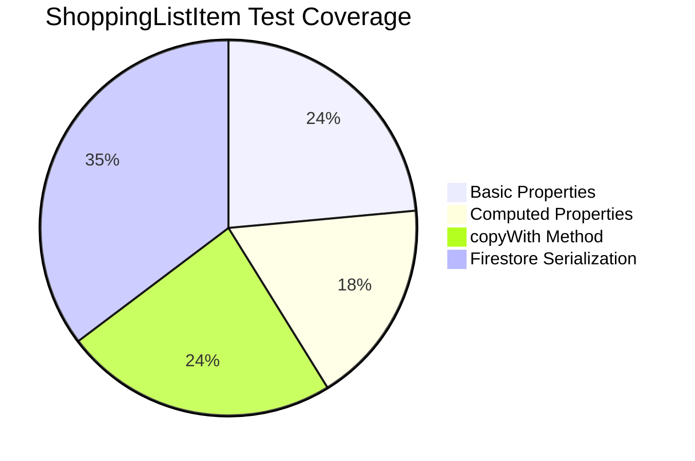
```mermaid
pie title ShoppingListItem Test Coverage
    "Basic Properties" : 8
    "Computed Properties" : 6
    "copyWith Method" : 8
    "Firestore Serialization" : 12
```

#### Model Structure

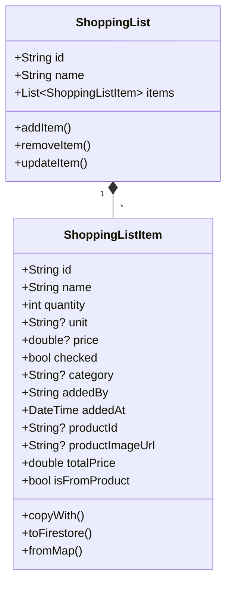
```mermaid
classDiagram
    class ShoppingListItem {
        +String id
        +String name
        +int quantity
        +String? unit
        +double? price
        +bool checked
        +String? category
        +String addedBy
        +DateTime addedAt
        +String? productId
        +String? productImageUrl
        +double totalPrice
        +bool isFromProduct
        +copyWith()
        +toFirestore()
        +fromMap()
    }
    
    class ShoppingList {
        +String id
        +String name
        +List~ShoppingListItem~ items
        +addItem()
        +removeItem()
        +updateItem()
    }
    
    ShoppingList "1" *-- "*" ShoppingListItem
```

#### Test Scenarios

| Test Group | Scenarios | Purpose |
|------------|-----------|---------|
| Basic Properties | Creates with required fields, handles optional fields | Verify constructor behavior |
| Computed Properties | totalPrice calculation, isFromProduct detection | Verify business logic |
| copyWith | All property updates, partial updates | Verify immutability pattern |
| toFirestore | All fields serialize, null handling | Verify Firebase compatibility |

#### Test Flow

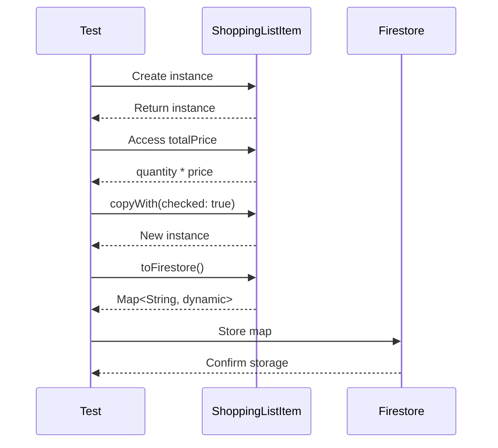
```mermaid
sequenceDiagram
    participant Test
    participant ShoppingListItem
    participant Firestore
    
    Test->>ShoppingListItem: Create instance
    ShoppingListItem-->>Test: Return instance
    
    Test->>ShoppingListItem: Access totalPrice
    ShoppingListItem-->>Test: quantity * price
    
    Test->>ShoppingListItem: copyWith(checked: true)
    ShoppingListItem-->>Test: New instance
    
    Test->>ShoppingListItem: toFirestore()
    ShoppingListItem-->>Test: Map<String, dynamic>
    
    Test->>Firestore: Store map
    Firestore-->>Test: Confirm storage
```

---

### Friend Model Tests

The `Friend` and `FriendRequest` models manage social connections in the app.

#### Test Coverage

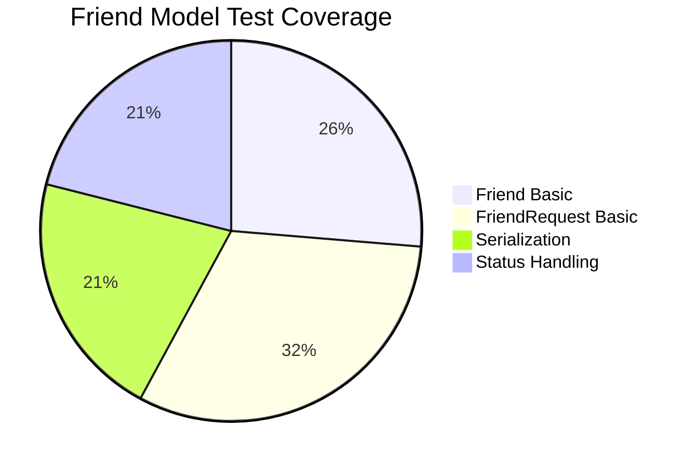
```mermaid
pie title Friend Model Test Coverage
    "Friend Basic" : 5
    "FriendRequest Basic" : 6
    "Serialization" : 4
    "Status Handling" : 4
```

#### Model Structure

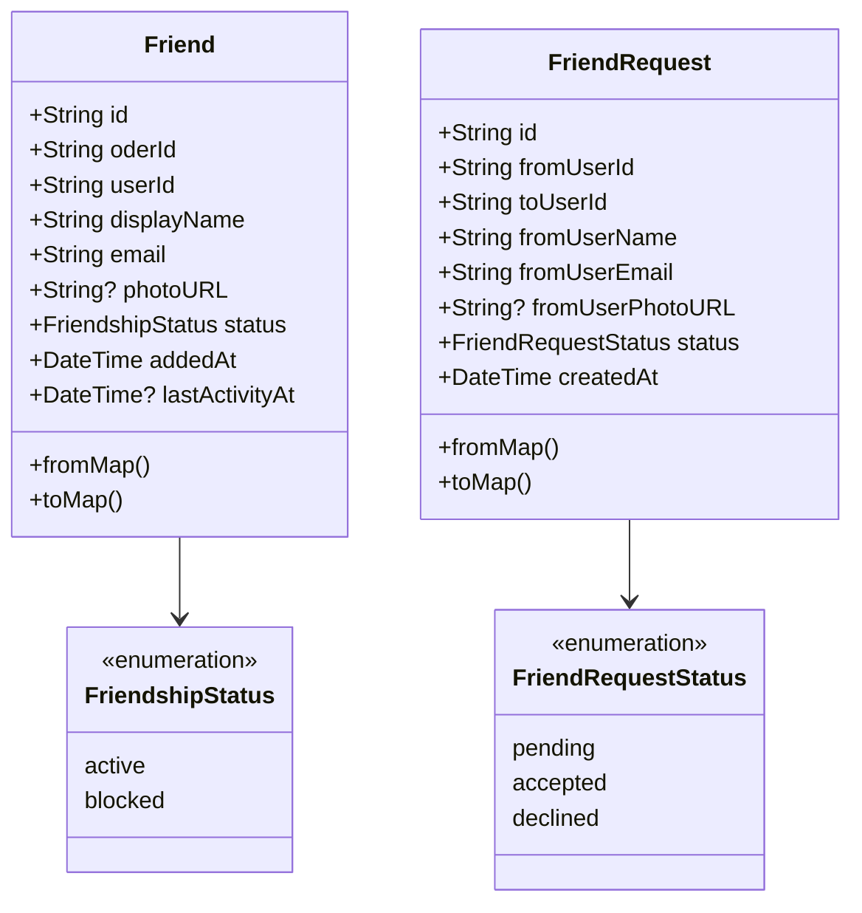
```mermaid
classDiagram
    class Friend {
        +String id
        +String oderId
        +String userId
        +String displayName
        +String email
        +String? photoURL
        +FriendshipStatus status
        +DateTime addedAt
        +DateTime? lastActivityAt
        +fromMap()
        +toMap()
    }
    
    class FriendRequest {
        +String id
        +String fromUserId
        +String toUserId
        +String fromUserName
        +String fromUserEmail
        +String? fromUserPhotoURL
        +FriendRequestStatus status
        +DateTime createdAt
        +fromMap()
        +toMap()
    }
    
    class FriendshipStatus {
        <<enumeration>>
        active
        blocked
    }
    
    class FriendRequestStatus {
        <<enumeration>>
        pending
        accepted
        declined
    }
    
    Friend --> FriendshipStatus
    FriendRequest --> FriendRequestStatus
```

#### State Transitions

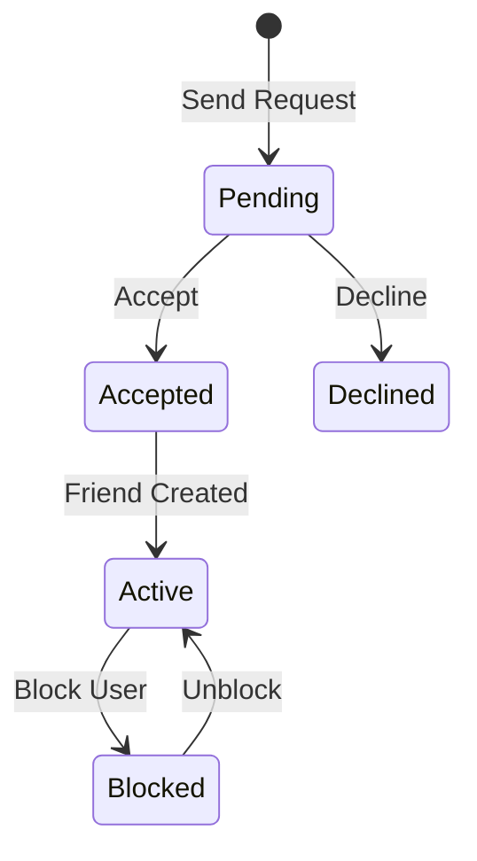
```mermaid
stateDiagram-v2
    [*] --> Pending: Send Request
    Pending --> Accepted: Accept
    Pending --> Declined: Decline
    Accepted --> Active: Friend Created
    Active --> Blocked: Block User
    Blocked --> Active: Unblock
```

---

## Service Tests

### Privacy Settings Service

The `PrivacySettingsService` manages user privacy preferences with caching.

#### Architecture

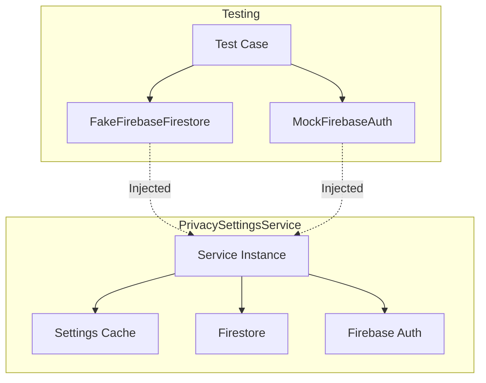
```mermaid
graph TB
    subgraph "PrivacySettingsService"
        PS[Service Instance]
        Cache[Settings Cache]
        FS[Firestore]
        Auth[Firebase Auth]
    end
    
    subgraph "Testing"
        Test[Test Case]
        FakeFS[FakeFirebaseFirestore]
        MockAuth[MockFirebaseAuth]
    end
    
    PS --> Cache
    PS --> FS
    PS --> Auth
    
    Test --> FakeFS
    Test --> MockAuth
    FakeFS -.-> |Injected| PS
    MockAuth -.-> |Injected| PS
```

#### Testability Pattern

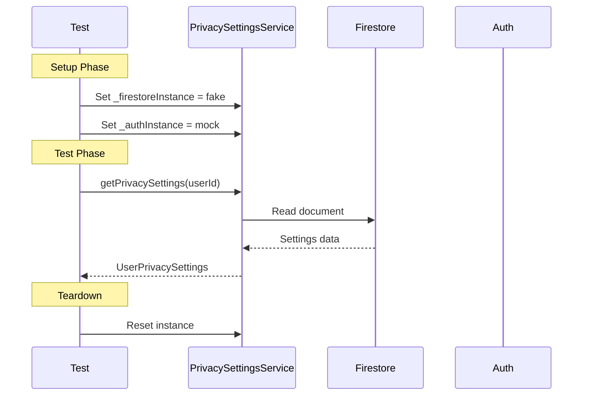
```mermaid
sequenceDiagram
    participant Test
    participant Service as PrivacySettingsService
    participant Firestore
    participant Auth
    
    Note over Test: Setup Phase
    Test->>Service: Set _firestoreInstance = fake
    Test->>Service: Set _authInstance = mock
    
    Note over Test: Test Phase
    Test->>Service: getPrivacySettings(userId)
    Service->>Firestore: Read document
    Firestore-->>Service: Settings data
    Service-->>Test: UserPrivacySettings
    
    Note over Test: Teardown
    Test->>Service: Reset instance
```

#### Key Implementation: Lazy Loading Pattern

```dart
// Before: Breaks tests
class PrivacySettingsService {
  final _firestore = FirebaseFirestore.instance; // ❌ Hard-coded
}

// After: Testable
class PrivacySettingsService {
  FirebaseFirestore? _firestoreInstance;
  FirebaseFirestore get _firestore => _firestoreInstance ?? FirebaseFirestore.instance;
  set _firestoreInstance(FirebaseFirestore? instance) => _firestoreInstance = instance;
}
```

---

### Presence Service

The `PresenceService` tracks user online/offline status for real-time features.

#### Mock Implementation

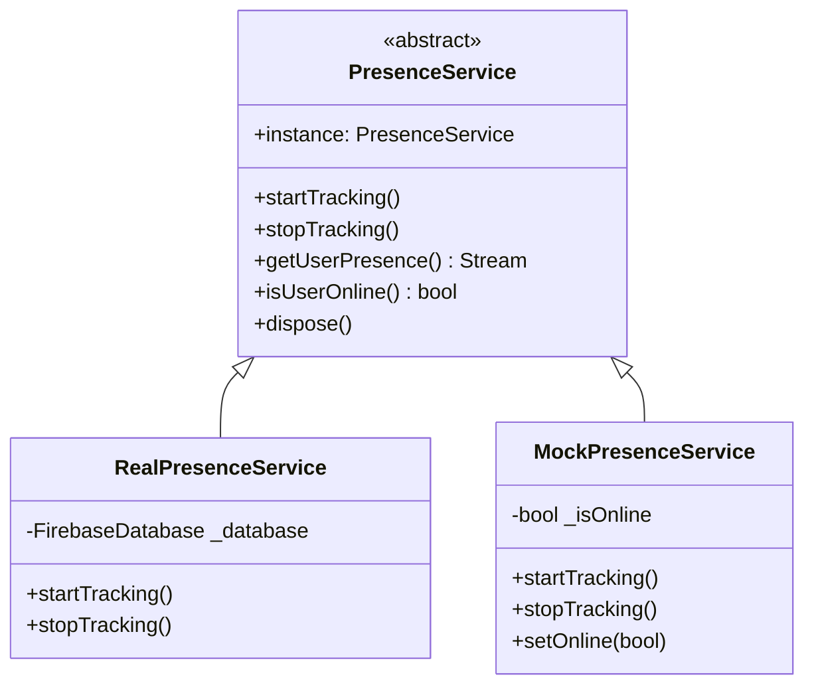
```mermaid
classDiagram
    class PresenceService {
        <<abstract>>
        +instance: PresenceService
        +startTracking()
        +stopTracking()
        +getUserPresence() Stream
        +isUserOnline() bool
        +dispose()
    }
    
    class RealPresenceService {
        -FirebaseDatabase _database
        +startTracking()
        +stopTracking()
    }
    
    class MockPresenceService {
        -bool _isOnline
        +startTracking()
        +stopTracking()
        +setOnline(bool)
    }
    
    PresenceService <|-- RealPresenceService
    PresenceService <|-- MockPresenceService
```

#### Test Setup Flow

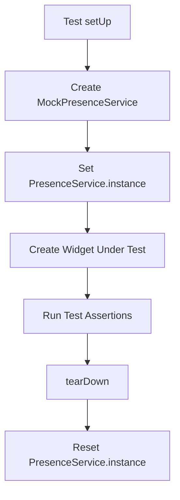
```mermaid
flowchart TD
    A[Test setUp] --> B[Create MockPresenceService]
    B --> C[Set PresenceService.instance]
    C --> D[Create Widget Under Test]
    D --> E[Run Test Assertions]
    E --> F[tearDown]
    F --> G[Reset PresenceService.instance]
```

---

## UI Tests

### FriendsScreen Tests

#### Test Architecture

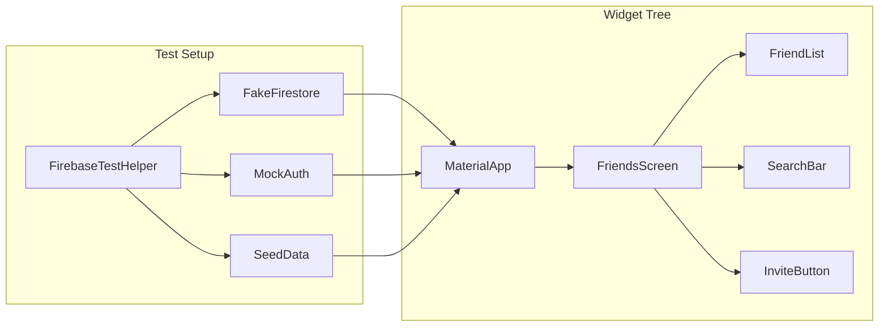
```mermaid
graph LR
    subgraph "Test Setup"
        A[FirebaseTestHelper] --> B[FakeFirestore]
        A --> C[MockAuth]
        A --> D[SeedData]
    end
    
    subgraph "Widget Tree"
        E[MaterialApp] --> F[FriendsScreen]
        F --> G[FriendList]
        F --> H[SearchBar]
        F --> I[InviteButton]
    end
    
    B --> E
    C --> E
    D --> E
```

#### Test Scenarios

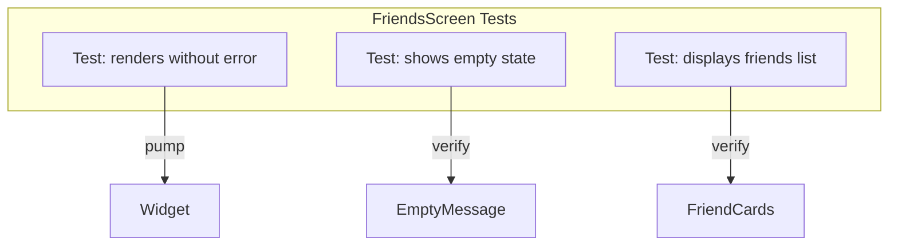
```mermaid
flowchart TB
    subgraph "FriendsScreen Tests"
        T1[Test: renders without error]
        T2[Test: shows empty state]
        T3[Test: displays friends list]
    end
    
    T1 --> |pump| Widget
    T2 --> |verify| EmptyMessage
    T3 --> |verify| FriendCards
```

### ModernChatScreen Tests

#### Mock Dependencies

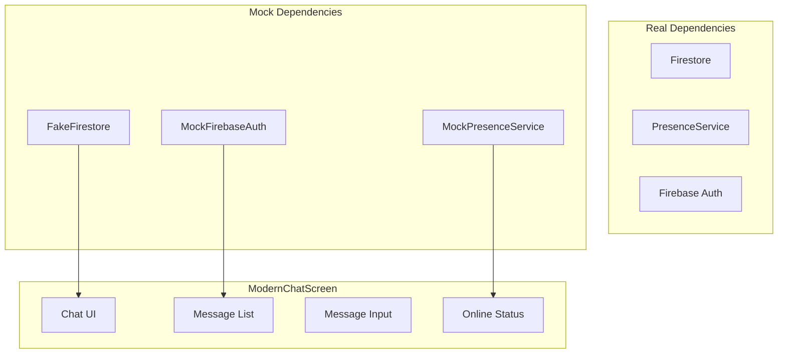
```mermaid
graph TB
    subgraph "Real Dependencies"
        FS[Firestore]
        PS[PresenceService]
        Auth[Firebase Auth]
    end
    
    subgraph "Mock Dependencies"
        FFS[FakeFirestore]
        MPS[MockPresenceService]
        MA[MockFirebaseAuth]
    end
    
    subgraph "ModernChatScreen"
        Chat[Chat UI]
        Messages[Message List]
        Input[Message Input]
        Status[Online Status]
    end
    
    FFS --> Chat
    MPS --> Status
    MA --> Messages
```

---

## Test Infrastructure

### FirebaseTestHelper

The `FirebaseTestHelper` class provides centralized setup for Firebase mocks.

#### Responsibilities

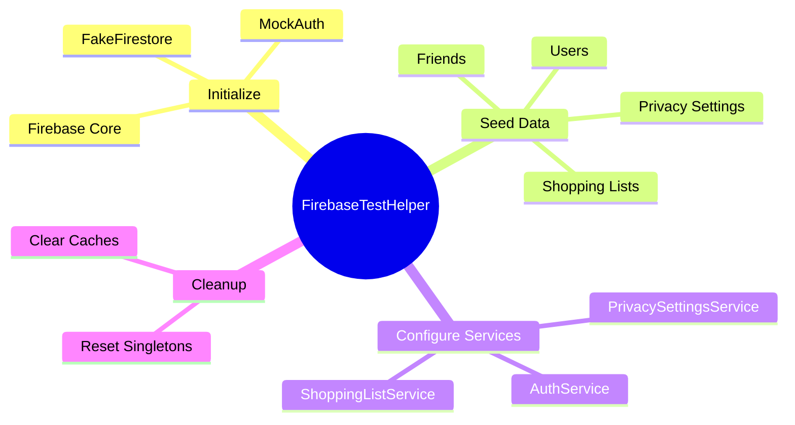
```mermaid
mindmap
  root((FirebaseTestHelper))
    Initialize
      Firebase Core
      FakeFirestore
      MockAuth
    Seed Data
      Users
      Privacy Settings
      Shopping Lists
      Friends
    Configure Services
      PrivacySettingsService
      AuthService
      ShoppingListService
    Cleanup
      Reset Singletons
      Clear Caches
```

#### Usage Pattern

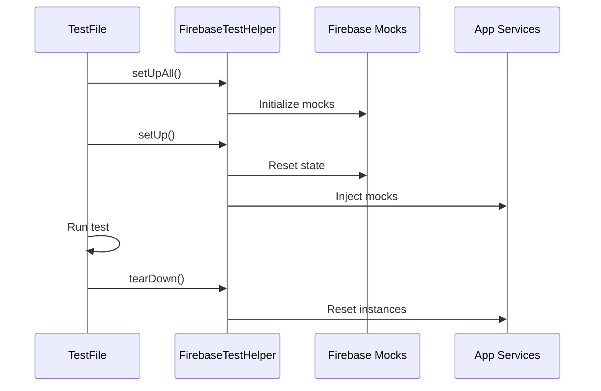
```mermaid
sequenceDiagram
    participant TestFile
    participant Helper as FirebaseTestHelper
    participant Firebase as Firebase Mocks
    participant Service as App Services
    
    TestFile->>Helper: setUpAll()
    Helper->>Firebase: Initialize mocks
    
    TestFile->>Helper: setUp()
    Helper->>Firebase: Reset state
    Helper->>Service: Inject mocks
    
    TestFile->>TestFile: Run test
    
    TestFile->>Helper: tearDown()
    Helper->>Service: Reset instances
```

### Mock Service Pattern

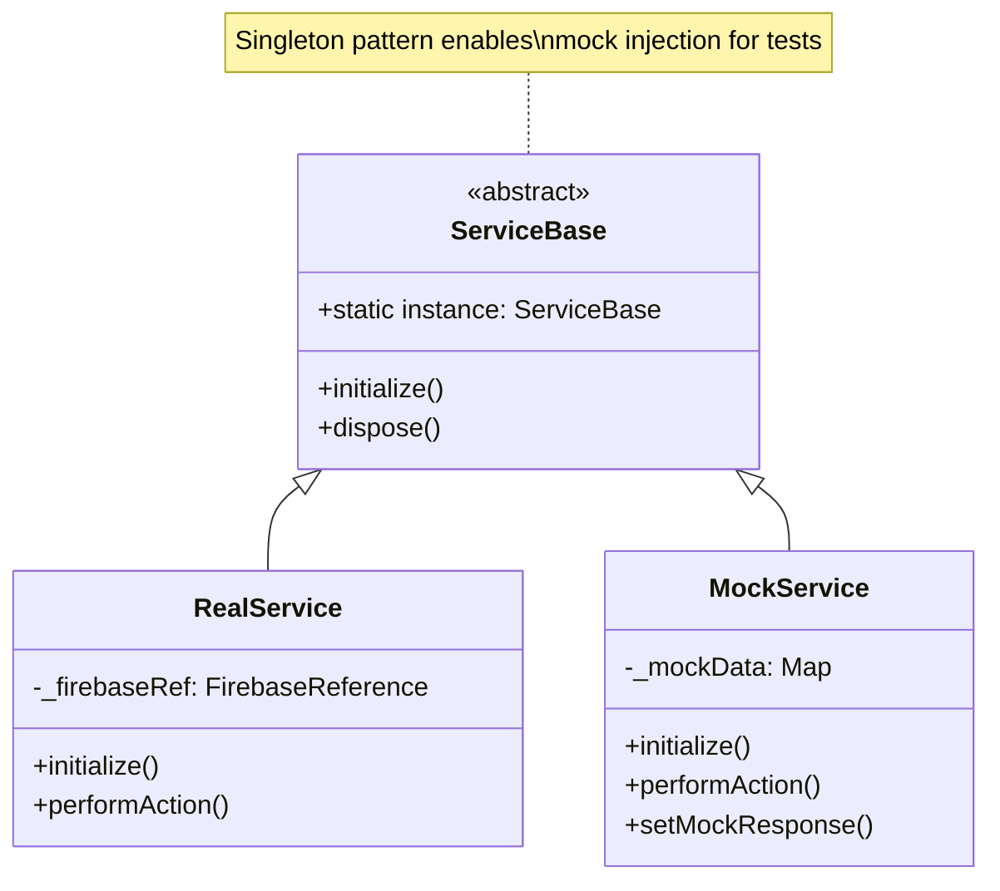
```mermaid
classDiagram
    class ServiceBase {
        <<abstract>>
        +static instance: ServiceBase
        +initialize()
        +dispose()
    }
    
    class RealService {
        -_firebaseRef: FirebaseReference
        +initialize()
        +performAction()
    }
    
    class MockService {
        -_mockData: Map
        +initialize()
        +performAction()
        +setMockResponse()
    }
    
    ServiceBase <|-- RealService
    ServiceBase <|-- MockService
    
    note for ServiceBase "Singleton pattern enables\nmock injection for tests"
```

---

## Best Practices

### 1. Service Testability

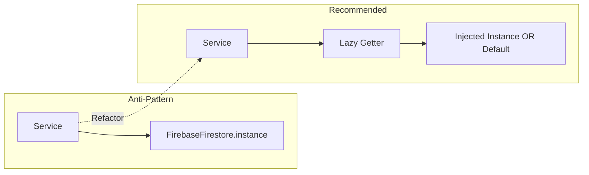
```mermaid
flowchart LR
    subgraph "Anti-Pattern"
        A1[Service] --> A2[FirebaseFirestore.instance]
    end
    
    subgraph "Recommended"
        B1[Service] --> B2[Lazy Getter]
        B2 --> B3[Injected Instance OR Default]
    end
    
    A1 -.-> |Refactor| B1
```

### 2. Test Isolation

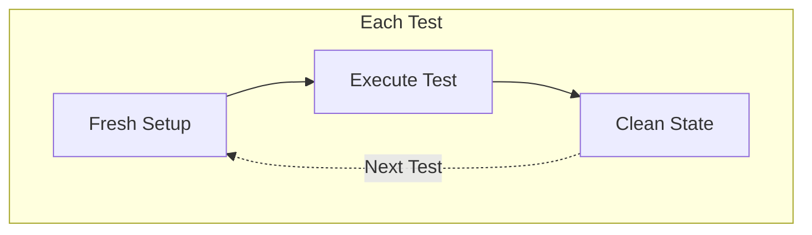
```mermaid
graph TB
    subgraph "Each Test"
        Setup[Fresh Setup]
        Run[Execute Test]
        Teardown[Clean State]
    end
    
    Setup --> Run
    Run --> Teardown
    Teardown -.-> |Next Test| Setup
```

### 3. Mock Injection

```mermaid
sequenceDiagram
    participant Test
    participant Service
    participant Mock
    participant Real
    
    Note over Test, Real: Production
    Service->>Real: Use default instance
    
    Note over Test, Mock: Testing
    Test->>Service: service._instance = mock
    Service->>Mock: Use injected mock
```

---

## Running Tests

### Commands

```bash
# Run all tests
flutter test

# Run specific test file
flutter test test/unit/models/shopping_list_item_model_test.dart

# Run with coverage
flutter test --coverage

# Run tests in specific directory
flutter test test/unit/models/
```

### Test Output

```mermaid
flowchart LR
    A[flutter test] --> B{Tests Pass?}
    B -->|Yes| C[✅ All tests passed!]
    B -->|No| D[❌ Show failures]
    D --> E[Fix issues]
    E --> A
```

---

## Summary

The test suite provides comprehensive coverage of:

1. **Models**: Core data structures with serialization
2. **Services**: Business logic with Firebase dependencies
3. **UI**: Widget rendering and user interactions

Key patterns used:
- **Lazy loading** for Firebase service dependencies
- **Singleton injection** for mock services
- **FakeFirestore** for data seeding
- **Isolated test setup** for reliable results

The architecture enables fast, reliable testing while maintaining production code quality.
